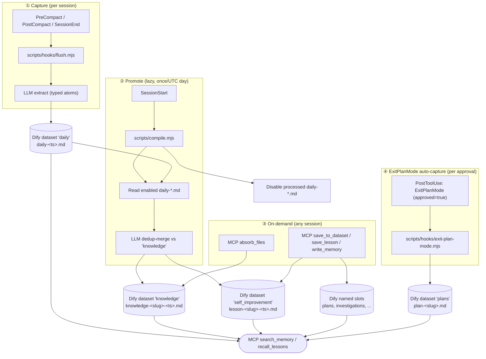

<h1 align="center">🧠 Local Dify MCP Memory — the self-learning RAG that makes your AI stop repeating its mistakes</h1>

<p align="center">
  <strong>Typed, deduplicated, self-improving project memory for AI coding agents.</strong>
</p>

<p align="center">
  A local Dify Knowledge stack for high-precision RAG, a stdio MCP bridge for every modern agent client, a two-stage <code>flush + compile</code> pipeline that distils sessions into typed atoms instead of dumping transcripts, and a dedicated <code>self_improvement</code> dataset where the agent records every correction you give it (and looks up the lesson before related work, so it stops making the same mistake twice).
</p>

<p align="center">
  <a href="https://github.com/ctxr-dev/memory/actions/workflows/ci.yml"></a>
  <a href="https://github.com/ctxr-dev/memory/releases/latest"></a>
  <a href="LICENSE"></a>
  
  
  
  
  
  
  
  
</p>

<p align="center">
  <a href="#install">Install</a>
  |
  <a href="#how-memory-is-built">Pipeline</a>
  |
  <a href="#what-gets-saved">Categories</a>
  |
  <a href="#updates">Updates</a>
  |
  <a href="#client-config">Clients</a>
  |
  <a href="STACK.md">Stack docs</a>
  |
  <a href="CONTRIBUTING.md">Contributing</a>
  |
  <a href="SECURITY.md">Security</a>
  |
  <a href="CHANGELOG.md">Changelog</a>
</p>

<p align="center">
  
</p>

## Why this exists

Dumping raw transcripts into a vector store turns a signal-to-noise problem into an embedding-space problem: at scale, retrieval surfaces the noise.

This boilerplate replaces the dump with a two-stage pipeline:

1. **Flush.** Lifecycle hooks (`PreCompact`, `PostCompact`, `SessionEnd`) call your local LLM (Claude Code CLI by default; Codex, Anthropic, or OpenAI also supported) to extract typed atoms (decisions, bug root causes, feedback rules, lore, references, gotchas) into one `daily-<YYYY-MM-DD-HHMMSSmmm>.md` document per flush.
2. **Compile.** The first `SessionStart` of each new UTC day spawns `compile.mjs` in the background. It reads enabled `daily-*.md` docs, dedup-merges atoms against existing `knowledge-*.md` docs (LLM decides create / update / skip), then disables the source dailies (kept for audit, hidden from search).

Most sessions contribute 0 to 3 small atoms, dedup-merged across history, with metadata that makes retrieval boringly correct.

## Install

The boilerplate is consumed as `./.memory/src/` inside your project, with its own git history retained for `git pull` updates. Two phases, drive each manually or via an AI prompt:

| Phase | What it does | Manual | AI-driven |
|---|---|---|---|
| **1. Host install** | clone, render configs, start Docker stack | [Manual install](#manual-install) | [🤖 AI-driven install](#-ai-driven-install) |
| **2. Dify onboarding** *(after MCP-client restart)* | API key, dataset slots, metadata schema, optional doc absorb | [Manual flow](#manual-flow) | [🤖 AI-driven flow](#-ai-driven-flow) |

> **Why two prompts?** The MCP server only becomes callable AFTER your client (Claude Desktop, Cursor, Codex) restarts to pick it up. Phase 2 uses MCP tools (`list_datasets`, `create_dataset`, `absorb_files`, ...) that don't exist before that restart, so it can't share a session with Phase 1. Run Phase 1, restart your client, then run Phase 2.

### Prerequisites

- Docker Desktop 4.x+ with Docker Compose 2.24.4+
- Node 20+ (used at install AND runtime; no `jq` or other extras needed)
- bash 3.2+, plus standard POSIX utilities (`awk`, `sed`, `grep`, `find`, `mktemp`, `tr`, `cut`)
- `git`, `curl`

**Cross-platform:** macOS and Linux are first-class. **Windows works via WSL2 or Git Bash:** bootstrap is bash-only and intentionally avoids `jq`, `realpath`, `gsed`, or any other non-portable binary.

<details>
<summary>Docker via Rancher Desktop / Colima (non-standard path)</summary>

If your `docker` comes from **Rancher Desktop** (`~/.rd/bin/docker`), Colima, or another non-standard location, the install scripts auto-resolve it: `bootstrap.sh` and `scripts/lib.sh` probe `~/.rd/bin`, `/usr/local/bin`, `/opt/homebrew/bin`, and the Rancher app bundle before giving up, and you can force a specific binary with `DOCKER_BIN=/path/to/docker`. One caveat the scripts can't fix for you: the **Claude Code / MCP-client process** that spawns the memory server runs `docker exec …` from its own environment, and Rancher only adds `~/.rd/bin` to your **interactive** shell PATH (via `.zshrc`/`.bashrc`). If the MCP server fails to start with "docker: command not found", ensure your client is launched from a shell that has `~/.rd/bin` on PATH (or symlink `docker` into `/usr/local/bin`).
</details>

<details>
<summary>Windows-specific gotchas</summary>

- **Line endings**: the repo ships `.gitattributes` forcing LF on shell + Node + config files. If you cloned with `core.autocrlf=true` (Git for Windows default) BEFORE these directives existed locally, run `git add --renormalize . && git checkout .` to fix any CRLF in your working tree, otherwise `bash` will choke on `#!/usr/bin/env bash\r`.
- **Docker Desktop file sharing**: under Docker Desktop → Settings → Resources, enable the drive (non-WSL) or the WSL2 distro that contains your project. Without this, the workspace bind mounts empty and `scan_documents` / `absorb_files` see no source files.
- **Symlinks**: the repo ships zero symlinks; do not introduce any locally without enabling Windows Developer Mode (or accept that Git will substitute a 1-line text file for the symlink target).
</details>

### Manual install

```bash
# from inside the project root
git clone https://github.com/ctxr-dev/memory ./.memory/src
./.memory/src/bootstrap.sh --slug <project-slug>
./.memory/src/scripts/up.sh    # FIRST RUN IS SLOW: clones the upstream Dify repo
                          # into .memory/src/vendor/dify, pulls Dify images, and
                          # builds the bridge. First-run cold pull is 2-5 min
                          # multi-GB; warm cache is ~30-60s. up.sh prints
                          # the Dify UI URL
                          # at the end.
```

`bootstrap.sh` renders `.agents/` (vendor-neutral, for Cursor / Codex / Claude Desktop / generic MCP clients) and (when `--install-hooks` is on, default) also `.claude/settings.json` (Claude Code hooks) AND `.mcp.json` at the workspace root (Claude Code's project-scope MCP server registration; without this, `/mcp` does NOT see the new memory server even when the bridge is up). It also appends a `/.memory` block to `.gitignore`, detects available LLM CLIs (`claude`, `codex`, falls back to `anthropic` / `openai`), and creates `./.memory/settings/.env` from the template.

**Existing config files are structurally merged, never overwritten:** your hooks, MCP servers, and permissions all pass through verbatim and only boilerplate-owned entries are added or refreshed (see [Updates → Merge contract](#merge-contract)). Re-runs leave `./.memory/settings/.env` untouched.

After the stack is up, finish wiring with the [onboarding wizard](#manual-flow) (or the [AI-driven flow](#-ai-driven-flow)).

### 🤖 AI-driven install

> **Phase 1 of 2.** Host-side install only (clone, bootstrap, docker stack up). Run [Phase 2](#-ai-driven-flow) AFTER the stack is up AND your MCP client restarts.

Paste this prompt into your agent (Claude Code, Cursor, Codex) running inside the target project root:

```text
Install the local Dify MCP memory boilerplate into this project. Target the current working directory unless I explicitly give you another path.

Steps:

1. Confirm the boilerplate Git URL with me first if you cannot infer it. Default: https://github.com/ctxr-dev/memory

2. Ask me for the project slug. Lowercase ASCII a-z, 0-9, hyphen (e.g. billing-api, docs-site). If I give you a name, propose a sanitised slug derived from the project folder name and confirm. The slug becomes the per-project Docker container, image, and Compose project name, so multiple projects can run their own memory stacks without collisions.

3. Ask me which LLM provider to use for the flush + compile pipeline:
   - claude (recommended; spawns `claude -p`, no API key needed)
   - codex (spawns `codex exec --json`, no API key needed)
   - anthropic (REST with ANTHROPIC_API_KEY in ./.memory/settings/.env)
   - openai (REST with OPENAI_API_KEY in ./.memory/settings/.env)
   Detect which CLIs are on PATH before asking. If only one is available, default to it and ask me to confirm.

4. Ask whether to install Claude Code hooks (default: yes). Hooks live in .claude/settings.json and wire SessionStart, PreCompact, PostCompact, SessionEnd, and PostToolUse (matcher ExitPlanMode, for auto-capturing approved plans into the `plans` slot) to ./.memory/src/scripts/hooks/. Other clients can adapt .agents/hooks.json manually.

5. Ask which MCP clients I want registered: Claude Desktop, Cursor, Codex/OpenAI, generic. Note the choices for step 8; the actual snippets only exist after bootstrap.sh runs.

6. Verify host prerequisites or tell me exactly what is missing:
   - docker (Docker Desktop or engine) with `docker compose` 2.24.4+
   - node 20+
   - git, curl, bash 3.2+
   bootstrap.sh itself only enforces docker + node + docker-compose-version; git and curl are needed by `git clone` and the Dify-version probe. No `jq`, `realpath`, or other extras are required (the install path is intentionally portable to Git Bash on Windows).

7. Run the install. If I chose Codex/OpenAI as a client in step 5 AND the `codex` CLI is on PATH, append `--register-codex` so bootstrap auto-runs `codex mcp add` for me; otherwise tell me to run that command manually after step 8:
   git clone <boilerplate-git-url> ./.memory/src
   ./.memory/src/bootstrap.sh --slug <slug> --llm-provider <provider> [--no-hooks if I declined] [--register-codex if Codex picked]

8. Static verification only (Docker not yet required; the stack is not up yet):
   bash -n ./.memory/src/bootstrap.sh ./.memory/src/scripts/*.sh ./.memory/src/scripts/hooks/*.sh
   node --check ./.memory/src/scripts/compile.mjs ./.memory/src/scripts/hooks/flush.mjs ./.memory/src/scripts/hooks/session-start.mjs
   node --check ./.memory/src/scripts/lib/*.mjs ./.memory/src/mcp-server/src/*.js
   ( cd ./.memory/src && npm test )

   Then print the requested client snippets from `./.memory/src/.agents/clients/` (now that bootstrap has rendered them):
   ./.memory/src/scripts/mcp-config.sh all
   For Codex (if not auto-registered in step 7):
   codex mcp add <slug>-memory -- docker exec -i <slug>-memory node src/index.js

9. Start the stack. WARN ME this is slow on first run: dify-bootstrap clones the upstream Dify repo (~hundreds of MB) and `up.sh` then pulls and builds Dify + the bridge image (2-5 minutes on a cold pull, multi-GB; ~30-60s once the Docker image cache is warm):
   ./.memory/src/scripts/up.sh
   (`up.sh` invokes `ui-url.sh` itself, so the Dify UI URL is printed when it finishes.)

10. Tell me the exact next steps after the stack is up:
    a) Open the printed Dify UI URL.
    b) Create the admin account, configure an embedding model under Settings -> Model Provider (REQUIRED before any high_quality dataset can be created).
    c) Open Knowledge -> Service API, create a Knowledge API key.
    d) Restart your MCP client (Claude Desktop / Cursor / Codex / your terminal-spawned agent) so it picks up the new memory MCP server. The server only becomes callable after this restart.
    e) Run `./.memory/src/scripts/dify-setup.sh` to wire datasets, install the per-document metadata schema, and (optionally) absorb my existing docs. ALTERNATIVELY paste the second AI prompt from the README (under "Onboarding -> AI-driven flow") to a fresh agent session for an MCP-driven walkthrough that uses list_datasets / create_dataset / scan_documents / absorb_files instead of the wizard.
    f) Final end-to-end smoke (only valid after step e): `./.memory/src/scripts/mcp-smoke.sh` — read-only round-trip across get_memory_config, search_memory (plain + filtered), and recall_lessons.

Stop and ask me whenever you would otherwise guess. Do not proceed past any step on assumption. Your config lives in `./.memory/settings/.env` (created from `.memory/src/.env.example`); the wizard (`dify-setup.sh`) manages it. If you must hand-edit, edit `./.memory/settings/.env` (there is no `.memory/src/.env`).
```

## Onboarding

`dify-setup.sh` is a re-runnable wizard. Once Dify is up and you've configured an embedding model under **Settings → Model Provider** in the UI, it asks at most:

1. **`DIFY_KNOWLEDGE_API_KEY`**: paste it (or skip if already in `./.memory/settings/.env`).
2. **For each dataset slot** (every `DIFY_DATASET_<NAME>_ID=` line in `./.memory/settings/.env`; defaults: `daily, knowledge, plans, investigations, self_improvement`): auto-create with that name (high_quality + hybrid_search), paste an existing id, or skip.
3. **Metadata schema**: installs the six per-document fields (`atom_type`, `tags`, `project_module`, `language`, `task_type`, `error_pattern`) on every bound slot, plus optional Dify built-ins (`document_name`, `upload_date`, `last_update_date`).
4. **Bridge restart**: propagates new env to the MCP bridge.
5. **Absorb existing docs?**: optional. Scans the workspace, picks files into slots (default `knowledge`), upserts each as `relative_path_with_underscores.md`. Re-running overwrites instead of duplicating.

Add a slot later by appending a new `DIFY_DATASET_<NAME>_ID=` line to `./.memory/settings/.env` and re-running `dify-setup.sh`; it only asks about new slots.

### Manual flow

<details>
<summary>Expand: manual onboarding flow</summary>

```bash
./.memory/src/scripts/up.sh           # start Dify + MCP bridge
./.memory/src/scripts/ui-url.sh       # open the printed Dify UI URL
                                 # In Dify: admin -> embedding model -> Service API -> create Knowledge API key
./.memory/src/scripts/dify-setup.sh   # paste key, bind/create slots, optional absorb
./.memory/src/scripts/mcp-smoke.sh    # validate
```

After upgrading the boilerplate via `git pull`, recreate the bridge so it picks up new env lines:

```bash
./.memory/src/scripts/up.sh memory_mcp   # rebuilds + recreates only the bridge service
                                    # (small image, typically <10s)
```

(A raw `docker compose ... up -d memory_mcp` from the workspace root would fail because Docker Compose can't find `docker-compose.yaml` there; the `./.memory/src/scripts/` wrappers add the correct `-f` flags via `scripts/lib.sh`.)

</details>

### 🤖 AI-driven flow

> **Phase 2 of 2.** Run [Phase 1](#-ai-driven-install) FIRST, then **restart your MCP client** so the new `<slug>-memory` server is registered. Only paste this prompt after that restart: it uses MCP tools (`list_datasets`, `create_dataset`, `scan_documents`, `absorb_files`, `save_lesson`, `recall_lessons`) that don't exist until then.

Paste the prompt below to your agent (Claude Code, Cursor, Codex with the MCP server registered):

```text
Set up the Dify memory boilerplate for this project. The MCP server is `<project-slug>-memory`. Do this:

1. Call `get_memory_config` to confirm DIFY_KNOWLEDGE_API_KEY is set (the bridge surfaces `apiKeyConfigured: true|false` without leaking the key). If false, STOP and tell me to:
   (a) Open the Dify UI URL printed by ./.memory/src/scripts/ui-url.sh
   (b) Sign in, configure an embedding model under Settings → Model Provider (REQUIRED before any high_quality dataset can be created)
   (c) Knowledge → Service API → create a Knowledge API key
   (d) Paste the key into ./.memory/settings/.env as DIFY_KNOWLEDGE_API_KEY=<key>
   (e) Recreate the bridge so the new env is picked up:
       ./.memory/src/scripts/up.sh memory_mcp
   THEN re-run me. Do not attempt to proceed without the key — `dify-setup.sh --non-interactive` will exit FATAL.

2. Call `list_datasets` to see what already exists in Dify.
3. For each of these slots (daily, knowledge, plans, investigations, self_improvement), check whether a dataset with that name already exists.
   - If it exists, tell me the id and ask whether to bind it.
   - If it does not, ask whether to call `create_dataset` to create it (high_quality + hybrid_search; requires the embedding model from step 1).
4. Tell me which DIFY_DATASET_<NAME>_ID values to put in ./.memory/settings/.env, then I will run `./.memory/src/scripts/dify-setup.sh --non-interactive --auto-create` to commit them, OR you tell me the exact lines to paste. The wizard also installs the per-document metadata schema (atom_type, tags, project_module, language, task_type, error_pattern) on every bound slot.
5. Then call `scan_documents` (default globs cover .md/.mdx/.markdown/.txt/.rst/.adoc) and show me the file list with proposed doc names.
6. Ask which subset I want absorbed and into which slot (default: knowledge). Use `absorb_files` with `dryRun=true` first, show me the result, and only do the real call after I confirm.

7. Sanity round-trip (proves the metadata schema you installed in step 4 actually works): call `save_lesson` with a deliberately-tagged smoke lesson (title "Onboarding smoke", error_pattern "smoke-test", project_module "smoke", task_type "unknown"), then immediately call `recall_lessons(query="smoke", project_module="smoke")`. The lesson must round-trip. If it does NOT, the metadata schema install probably failed; tell me to re-run `./.memory/src/scripts/dify-setup.sh`.

8. Tell me about the cleanup tools available. Three MCP tools handle retracting auto-captured / absorbed docs: `delete_document` (permanent, accepts any slot — use sparingly on lessons / compile-managed slots), `disable_document` (soft, hides from search but keeps audit trail), `enable_document` (reverses a disable). Mention these so I know how to clean up if a plan title changes (the auto-capture writes a new doc under the new slug; the old slug stays unless I explicitly remove it).

Stop and ask me whenever you would otherwise guess. This is configuration, not refactoring.
```

### Saving plans, investigations, or other artefacts manually

<details>
<summary>Expand: manual artefact saving</summary>

`save_to_dataset(dataset, name, text, metadata?)` does upsert-by-exact-name: same `name` overwrites, no duplicates. Iterate freely on a `plan-auth-rewrite.md` and the second save replaces the first. Same applies to absorbed files. The optional `metadata` map applies the per-document Dify fields so the doc is filterable in future `search_memory` and `recall_lessons` calls.

**Plans approved via `ExitPlanMode` are auto-captured** to the `plans` slot by the boilerplate's `PostToolUse` hook (`scripts/hooks/exit-plan-mode.mjs`, invoked via the `exit-plan-mode.sh` wrapper). The doc name is `plan-<slugified-title>.md`, derived from the first H1 in the plan body, so iterating on the same titled plan overwrites the same Dify doc. Tagged `atom_type=plan`, `task_type=planning` (no `project_module` so it doesn't pollute filters; add one via a manual `save_to_dataset` if you want per-module scoping). The hook is a no-op when the user rejects the plan (`tool_response.approved !== true`), when the plan body is empty, when the `plans` slot isn't bound, or when the bridge is unavailable. **The hook only fires once Claude Code reloads `.claude/settings.json`, so after a fresh install or an upgrade you must restart Claude Code before the first plan capture will trigger.** See the [`plan-capture` skill](templates/skills/plan-capture.md) for the agent-facing contract. Investigations remain manual: call `save_to_dataset(dataset="investigations", name=...)` directly until the equivalent capture point exists.

</details>

## Self-improvement loop

A dedicated `self_improvement` dataset captures lessons learned **only** from negative or corrective user feedback. Agents check it before related work via `recall_lessons`.

### Two MCP entry points

<details>
<summary>Expand: recall_lessons and save_lesson contract</summary>

- **`recall_lessons(query, project_module?, language?, task_type?, error_pattern?, tags?, includeKnowledge?, scoreThreshold?, maxResults?)`** — call BEFORE non-trivial work. Filters `self_improvement` by `atom_type=self-improvement-lesson` plus context. Broadens via fall-back ladder (drops `error_pattern` → `language` → `task_type`) until `min(3, maxResults)` UNIQUE hits or the ladder is exhausted. `project_module` and `tags` are caller-chosen scoping signals and are NEVER dropped. Defaults: `scoreThreshold=0.55`, `maxResults=5`. When `project_module` is set AND `includeKnowledge !== false` (default true), also pulls top `bug-root-cause` + `feedback-rule` from `knowledge` (max 2, appended after lessons, never displacing them).
- **`save_lesson(title, body, metadata, tags?, evidence?)`** — call IMMEDIATELY when the user corrects you (before replying). Required `metadata.error_pattern` is the dedup key: same `error_pattern` MERGES rather than multiplies in compile. The doc name `lesson-<slug>-<ts>.md` matches the format compile recognises, so inline-saved lessons participate in the same dedup-merge pipeline. Available on the next turn.

</details>

### Two capture paths feed `self_improvement`

<details>
<summary>Expand: capture paths</summary>

1. **Inline (`save_lesson`)**: agent observes correction mid-session and persists immediately. Queryable on the very next turn.
2. **Flush extraction**: `prompts/flush.md` recognises a `self-improvement-lesson` atom type with the same triggers; lessons missed mid-session are captured at hook boundaries. Compile then routes them to `self_improvement` and dedup-merges by `error_pattern`.

</details>

### Lesson triggers

| ✅ Save | ❌ Don't save |
|---|---|
| Direct correction ("no", "stop doing X", reverting your work, "wrong") | Routine clarification or neutral redirection ("let's switch to X") |
| Repeat correction ("I told you before", "again", "same mistake") | User changing their mind about scope |
| Wrong-tool / wrong-step / wrong-format | User self-blame ("oh wait, I gave you the wrong file") |
| | Exploration or thinking out loud |

### Metadata schema

<details>
<summary>Expand: metadata schema fields</summary>

Six per-document fields, installed by `dify-setup.sh` on every bound slot (Dify only supports string/number/time, so `tags` is comma-separated, queried with `contains`):

| Field | Used by `recall_lessons` for | Notes |
|---|---|---|
| `atom_type` | filter by atom type | one of eight types (seven extracted by flush+compile, plus `plan` set by the ExitPlanMode hook); `self-improvement-lesson` is the lesson key |
| `project_module` | filter by part-of-codebase | lowercase, hyphenated; `unknown` when unsure |
| `language` | filter by programming language | empty for language-agnostic lessons |
| `task_type` | filter by task category | enum: planning, implementation, debugging, refactor, review, deploy, docs, unknown |
| `error_pattern` | filter and DEDUP by failure mode | required for `save_lesson`; short kebab-case slug like `missing-await`, `bsd-sed-no-arg` |
| `tags` | fulltext-style fallback | comma-separated list, queried with `contains` |

Built-in Dify fields (`document_name`, `upload_date`, `last_update_date`) can be enabled by the wizard for recency-based filtering.

</details>

### Retrieval contract

<details>
<summary>Expand: retrieval contract</summary>

`search_memory({ query, datasets?, filters?, scoreThreshold?, maxResults? })` applies `filters` as a Dify `metadata_condition` (AND-combined; `tags` uses `contains`, others use `is`) BEFORE the embedding rank, then drops anything below `scoreThreshold`. **Do not load the whole store**: filtered + thresholded retrieval is the contract.

</details>

## How memory is built

<details>
<summary>Expand: architecture diagram</summary>



**Everything lives in Dify**, organised by named slots, retrieved via metadata-filtered queries.

- **Named slots**: each `DIFY_DATASET_<NAME>_ID=` line in `./.memory/settings/.env` declares one slot. Defaults: `daily`, `knowledge`, `plans`, `investigations`, `self_improvement`. Add lines to add slots (`DIFY_DATASET_RUNBOOKS_ID=`, ...). No second list to maintain.
- **Per-atom-type routing**: compile sends `self-improvement-lesson` atoms to `self_improvement` and everything else to `knowledge`. Inline `save_lesson` hits `self_improvement` directly.
- **Naming inside Dify**:
  - `daily-<YYYY-MM-DD-HHMMSSmmm>.md`: one per flush event (dedup-merged out by compile).
  - `knowledge-<slug>-<YYYY-MM-DD-HHMMSSmmm>.md`: one per deduped fact (compile may write a new version with the same `<slug>` and a new `<ts>`, then disable the prior).
  - `lesson-<slug>-<YYYY-MM-DD-HHMMSSmmm>.md`: self-improvement lessons in `self_improvement`.
  - `<relative_path_with_underscores>.md`: absorbed user docs (`docs/auth/jwt.md` becomes `docs_auth_jwt.md`).
  - `<your-name>.md`: anything you upsert via `save_to_dataset` (plans, investigations, decisions). Same name overwrites; iterate freely.
- **Daily docs are kept after promotion** but disabled (audit trail in UI, hidden from `search_memory`).
- **No local memory files.** Only on-disk state is `./.memory/src/.compile-state.json` (last compile attempt date).
- **Recursion guard**: `CLAUDE_INVOKED_BY=memory_compile` prevents compile from triggering its own compile.
- **Failure modes are explicit**: missing LLM provider, missing Dify keys, or stopped MCP container all cause flush/compile/absorb to skip with a stderr message and exit 0. Hooks never block your session and never write fallback files.

</details>

## What gets saved

Two routes: **automatic distillation** (flush + compile) and **on-demand upserts** (absorb + save_to_dataset).

### Atoms extracted by flush+compile

<details>
<summary>Expand: atom types table</summary>

Seven atom types are produced by the flush LLM extractor (`prompts/flush.md`) and routed by compile. Each carries the metadata block (`project_module`, `language`, `task_type`, optional `error_pattern`) plus `tags`. The compile prompt biases toward **update** over **create** when `atom_type`, `project_module`, and (for lessons) `error_pattern` match: same fact never gets written twice; same lesson converges into one canonical document.

| Type | Use when | Routes to |
|---|---|---|
| `decision` | "We chose X over Y because Z." Architectural or product choice with rationale. | `knowledge` |
| `bug-root-cause` | The misleading symptom, the actual cause, and the trap to avoid. (Not the diff: that's in git.) | `knowledge` |
| `feedback-rule` | A workflow rule the user gave you. Conventions, exit predicates, do/don't. | `knowledge` |
| `project-lore` | Who's doing what, deadlines, integration quirks not in the code. Decays fast; atoms include dates. | `knowledge` |
| `reference` | A pointer to a dashboard, runbook, or external project, with the reason to consult it. | `knowledge` |
| `pattern-gotcha` | A reusable code-level lesson: API quirk, framework footgun, library behavior. | `knowledge` |
| `self-improvement-lesson` | NEGATIVE OR CORRECTIVE user feedback revealing a behaviour the AI should change next time. | `self_improvement` |

</details>

### Atoms set by hooks (not extracted from transcripts)

<details>
<summary>Expand: hook-set atom types</summary>

| Type | Set by | Routes to |
|---|---|---|
| `plan` | `PostToolUse/ExitPlanMode` hook on approval, or manual `save_to_dataset(dataset="plans", ...)`. The flush extractor is explicitly forbidden from producing this type (see `prompts/flush.md`). | `plans` |

</details>

### On-demand uploads

<details>
<summary>Expand: on-demand upload tools</summary>

Both use upsert-by-exact-name (delete-then-create): **same name → updated content; different name → new document**.

| MCP tool | When | Naming + identity |
|---|---|---|
| `absorb_files(files[], dataset?, dryRun?)` | Index existing project docs (`docs/**/*.md`, `ARCHITECTURE.md`, RFCs). | `relative/path/with/slashes.md` becomes `relative_path_with_slashes.md`. Re-running overwrites the same Dify document. |
| `save_to_dataset(dataset, name, text, metadata?)` | Save a plan, investigation, decision record, runbook. | The `name` IS the identity. Polishing the same `plan-auth-rewrite.md` later replaces the prior version. |

</details>

### MCP tools

<details>
<summary>Expand: MCP tool reference</summary>

| Tool | Purpose |
|---|---|
| `search_memory` | Retrieve scored chunks across configured datasets. Accepts `filters` (metadata) + `scoreThreshold` for precise, context-efficient recall. |
| `recall_lessons` | "Look before you leap" entry point. Filters `self_improvement` by inferred task context with broadening fall-back; optionally pulls `bug-root-cause` + `feedback-rule` from `knowledge`. |
| `get_memory_config` | Inspect bridge configuration without exposing secrets. |
| `write_memory` / `update_memory` | Create-or-supersede a single document (low-level; compile uses `update_memory`). |
| `save_to_dataset` | Upsert by exact name with optional `metadata` (durable-artefact path). |
| `save_lesson` | Sugar over `save_to_dataset` for `self_improvement`; required `metadata.error_pattern` is the dedup key. |
| `list_datasets` / `create_dataset` | Inspect or create Dify datasets; bind via `dify-setup.sh`. `create_dataset` auto-installs the per-document metadata schema (the six fields). |
| `delete_document` / `disable_document` / `enable_document` | Clean up an upserted doc by id. `delete_document` is permanent (warns about lessons/compile-managed slots); `disable_document` hides from search but keeps the audit trail; `enable_document` reverses a soft-delete. Use to retract a stale `plan-<old-slug>.md` after a title change, or any auto-captured / absorbed doc you no longer want indexed. |
| `audit_memory` | Walk the `plans`, `knowledge`, and `self_improvement` slots and return a list of cleanup candidates across four classes: `stale-plans` (slug substring of newer plan, leftover renames), `missing-metadata` (atom-type required fields absent), `stale-project-lore` (older than `MEMORY_AUDIT_LORE_STALE_DAYS`, default 90), `duplicate-error-pattern` (lessons sharing a pattern with a newer canonical). List-only; act via `delete_document` / `disable_document`. |
| `scan_documents` | Walk the workspace mount; return matches + suggested doc names. The default ignore list (`.git`, `node_modules`, `.venv`, `__pycache__`, `target`, `vendor`, `dist`, `build`, `.next`, `Pods`, `DerivedData`, `_build`, `.terraform`, `.idea`, etc., at any nesting depth) is ALWAYS applied; user `ignore` patterns are added on top, never used as a replacement. `include` defaults to markdown/text; pass `include` to override. |
| `absorb_files` | Read selected files; upsert each into the chosen dataset. |

</details>

## Updates

<details>
<summary>Expand: upgrade recipe</summary>

```bash
cd .memory/src && git pull && cd .. && ./.memory/src/bootstrap.sh --slug <project-slug>
./.memory/src/scripts/up.sh memory_mcp   # recreate the bridge so it picks up env changes
```

Re-running bootstrap is idempotent: `./.memory/settings/.env` is preserved across upgrades; only template-derived files (`.agents/*`, `.claude/settings.json`, `.agents/rules/*`, `.claude/skills/*`) are re-rendered. The bridge reads `./.memory/settings/.env` via Compose's `env_file:`, so any new `DIFY_DATASET_<NAME>_ID=` line takes effect only after a recreate.

**Your config lives in `./.memory/settings/` and survives removing `./.memory/src`.** The canonical `./.memory/settings/.env` (API key + dataset-slot bindings + env knobs) and `./.memory/settings/.dify-version` (the pinned Dify release) live in the gitignored, data-side directory — NOT inside `./.memory/src`. `.memory/src/.env.example` is only the template. Because `./.memory/` also holds your Dify data and is never deleted with `./.memory/src`, you can safely `rm -rf ./.memory/src` (to upgrade clean, or remove the boilerplate) and a later `git clone … ./.memory/src && ./.memory/src/bootstrap.sh --slug <slug>` reuses your existing `./.memory/settings/.env` as-is — your API key + bindings stay attached (no `dify-setup.sh` re-run) and the same Dify version is reused. On every bootstrap, new keys added to `.memory/src/.env.example` upstream are auto-merged into your `settings/.env` (existing values untouched). `settings/.env` is `chmod 600`; treat `./.memory/settings/` as secret-bearing. (A pre-0.3.0 install with a legacy `.memory/src/.env` is migrated into `settings/.env` on the next bootstrap, then the legacy file is removed.)

**If you're upgrading across a plan-capture release**, also re-run `./.memory/src/scripts/dify-setup.sh` after `git pull` so the per-document metadata schema gets retro-installed on existing slots. See the callout below for the full upgrade recipe.

> **Upgrading to plan-capture (PostToolUse/ExitPlanMode hook):**
>
> Required steps in order:
>
> 1. **Re-run `./.memory/src/scripts/dify-setup.sh`** after `git pull`. The wizard's `install_metadata_schema` step is idempotent: it inspects every bound slot, only installs missing fields, and silently skips ones already present. Pre-existing slots created by an OLDER `create_dataset` MCP tool (which did NOT auto-install the schema before this commit) get the six per-document fields retro-installed in seconds. Without this, the new ExitPlanMode hook will succeed in writing plans but log `metadata warning: no fields matched dataset metadata schema` on every save until the wizard runs.
> 2. **Recreate the bridge container** to pick up env + image changes: `./.memory/src/scripts/up.sh memory_mcp`. The bridge reads `./.memory/settings/.env` only at container start time, so any new `MEMORY_HOOK_EXITPLANMODE_*` knob you added is invisible until restart.
> 3. **Restart your MCP client** (Claude Code / Cursor / Codex) so it picks up the new `.claude/settings.json` / `.agents/hooks.json` hook entries. Already-running sessions won't fire the new hook until restart.
>
> Optional: the `MEMORY_HOOK_EXITPLANMODE_DISABLE` and `MEMORY_HOOK_EXITPLANMODE_MAX_BYTES` knobs are auto-merged into your `./.memory/settings/.env` (commented-out) on the next bootstrap, so you can just uncomment and set them there. If you set them, redo step 2 to refresh bridge env.
>
> **Behavior change to be aware of:** `upsertDocumentByName` now reduces same-name documents to one per upsert (closes a concurrent-write race window). If you had transient duplicates from a prior bug, this commit silently merges them on the next upsert. Verify in the Dify UI before relying on the upsert path for non-plan content.

</details>

### Merge contract

<details>
<summary>Expand: merge contract</summary>

| File class | Behaviour on re-run |
|---|---|
| **Mixed-content** (`.claude/settings.json`, `.agents/{hooks,mcp}.json`, `.mcp.json`) | Structurally merged via `scripts/merge-config.mjs` (pure Node, no `jq`). Your existing entries (your own MCP servers, your own hook commands, your `permissions`, your `model`, anything else at the top level) pass through verbatim. Only entries whose `command` carries the boilerplate's signature (`"$CLAUDE_PROJECT_DIR"/.memory/src/scripts/hooks/...`) are stripped and re-installed; for `.mcp.json`, only the `<slug>-memory` server entry is owned by the boilerplate. Re-runs are byte-stable when nothing changes. |
| **Owned-only** (`.agents/clients/*`, `.agents/mcp/<server>.mcp.json`, `.agents/README.md`) | 100% generated by the boilerplate. Bootstrap REFUSES to overwrite if you have edited them: prints a conflict list and exits non-zero. Either delete the file then re-run, or move your edits elsewhere. |
| **Skill / rule files** (`.claude/skills/*.md`, `.agents/rules/*.md`) | Always overwritten on re-run; treat them as canonical from the boilerplate. |

</details>

### What gets committed

<details>
<summary>Expand: what gets committed</summary>

| Path | Tracked | Why |
|---|---|---|
| `/memory` | **No** | The cloned boilerplate has its own `.git`. |
| `/.memory` | **No** | Host-mounted Dify runtime data. |
| `/.agents`, `/.claude/settings.json`, `/.mcp.json` | **Yes** | Per-project agent config: vendor-neutral hooks/MCP + Claude Code hooks + project-scope MCP server registration. |
| `./.memory/settings/.env` | **No** | Contains your Dify API key. |
| `.memory/src/.compile-state.json`, `.memory/src/.compile.lock` | **No** | One-line ops state / transient lockfile. Not memory. |

> **Upgrading from a pre-`pwd -P` checkout (one-time):** if you cloned into a path with a symlink in it (common on macOS with iCloud-synced `~/Documents`, or Linux dev VMs with bind-mounted project trees) AND ran the boilerplate before scripts standardised on `pwd -P`, the next `up.sh` after `git pull` resolves `MEMORY_DATA_DIR` to the **physical** path. Docker treats that as a different bind source, so existing Dify storage volumes appear empty (your data is still on disk under the old, symlink-form path). Run `./.memory/src/scripts/migrate-persistent-data.sh` once to copy state into the resolved location, then `./.memory/src/scripts/up.sh`. Fresh installs are unaffected.

</details>

## Client config

<details>
<summary>Expand: client config</summary>

Generated client snippets live under `.agents/clients/` after bootstrap:

```bash
./.memory/src/scripts/mcp-config.sh all              # print every client snippet
./.memory/src/scripts/mcp-config.sh codex            # | claude-desktop | cursor
```

For Codex/OpenAI:

```bash
codex mcp add <project-slug>-memory -- docker exec -i <project-slug>-memory node src/index.js
```

For Claude Desktop, Cursor, or generic MCP clients, merge `.agents/mcp.json` (or the matching `.agents/clients/<client>` snippet) into your client's MCP config. Do not paste API keys into client configs; they live only in `./.memory/settings/.env`.

When `--install-hooks` is on (default), `.claude/settings.json` is rendered with the four lifecycle events wired to `./.memory/src/scripts/hooks/`. Other clients can adapt `.agents/hooks.json` to their own hook format; see [STACK.md](STACK.md) for the event-to-script table.

</details>

### Skills + rules

<details>
<summary>Expand: skills and rules</summary>

`bootstrap.sh` renders every `templates/skills/*.md` into BOTH:

- `.claude/skills/<name>.md` (only when `--install-hooks`): Claude Code's project skills directory; auto-loaded.
- `.agents/rules/<name>.md` (always): vendor-neutral. Cursor / Codex / generic clients can import from here.

Today the boilerplate ships three skills: `self-improvement.md` (the `recall_lessons` + `save_lesson` contract), `plan-capture.md` (how the `ExitPlanMode` auto-capture and manual `save_to_dataset` paths interact for the `plans` slot), and `investigation-capture.md` (when and how to save a long debugging session as a durable artefact in the `investigations` slot; agent-side rule, no hook).

</details>

## Hook reference

<details>
<summary>Expand: hook reference table</summary>

| Event | Script | Effect |
|---|---|---|
| `SessionStart` | `scripts/hooks/session-start.mjs` | Emits an `additionalContext` reminder; lazily spawns compile in the background once per UTC day. |
| `PreCompact` | `scripts/hooks/flush.mjs pre-compact` | Distils the recent transcript into typed atoms; writes ONE new `daily-<ts>.md` doc to the Dify daily dataset. Skips if fewer than `MEMORY_HOOK_PRECOMPACT_MIN_TURNS` turns. |
| `PostCompact` | `scripts/hooks/flush.mjs post-compact` | Distils Claude Code's `compact_summary` into atoms. Min-turns check bypassed for compact_summary input. |
| `SessionEnd` | `scripts/hooks/flush.mjs session-end` | Same as PreCompact, with `MEMORY_HOOK_SESSION_END_MIN_TURNS` floor. |
| `PostToolUse` (matcher `ExitPlanMode`) | `scripts/hooks/exit-plan-mode.mjs` | When the user approves a plan, upserts `plan-<slug>.md` into the `plans` dataset slot (deterministic, no LLM, no timestamp; same title overwrites). Body is redacted + wrapped in an untrusted-content fence. Skips cleanly (exit 0) with a stderr message on rejection, empty plan, oversized plan (`MEMORY_HOOK_EXITPLANMODE_MAX_BYTES`, default 256KB), unbound slot, bridge failure, or `MEMORY_HOOK_EXITPLANMODE_DISABLE=true`. See [`plan-capture` skill](templates/skills/plan-capture.md). |

Hook timeouts: 130s for flush hooks (LLM defaults to 120s per call + headroom), 30s for `PostToolUse/ExitPlanMode` (no LLM, but multiple bridge round-trips: find + create + metadata + re-list + dedupe-delete), 15s for `SessionStart` (only emits a reminder + spawns compile detached).

</details>

## Verification

<details>
<summary>Expand: verification tiers</summary>

Each tier lists its prereqs; stop at the latest one your environment can satisfy.

```bash
# Tier 1 — Static. Requires: bootstrap.sh only. No Docker, no LLM.
bash -n ./.memory/src/bootstrap.sh ./.memory/src/scripts/*.sh ./.memory/src/scripts/hooks/*.sh
node --check ./.memory/src/scripts/compile.mjs ./.memory/src/scripts/hooks/flush.mjs ./.memory/src/scripts/hooks/session-start.mjs
node --check ./.memory/src/scripts/lib/*.mjs ./.memory/src/mcp-server/src/*.js

# Tier 2 — Hermetic unit tests. Requires: node 20+.
( cd ./.memory/src && npm test )
# (`npm test` invokes `node --test test/*.test.mjs` from inside ./.memory/src/,
# so the glob is expanded against ./.memory/src/test/. Running it from the parent
# would fail because the glob expands BEFORE the cd.)

# Tier 3 — Stack health. Requires: up.sh has been run.
./.memory/src/scripts/ps.sh
./.memory/src/scripts/ui-url.sh

# Tier 4 — End-to-end MCP smoke. Requires: up.sh + dify-setup.sh + DIFY_KNOWLEDGE_API_KEY + ≥1 dataset bound.
# Read-only by design: initialize, get_memory_config, plain + filtered search_memory,
# recall_lessons round-trip with a deliberately-no-match query. Fails with a
# "Run dify-setup.sh" hint if any prereq is missing.
./.memory/src/scripts/mcp-smoke.sh

# Tier 5 — Entry-point smoke. Requires: bootstrap only.
# Without bridge + slots + LLM provider, both scripts SKIP gracefully (stderr, exit 0).
# That's the property we verify here: hooks never block the user's session.
echo '{"session_id":"smoke","hook_event_name":"PostCompact","compact_summary":"Decision: Dify is the canonical store for project memory."}' \
  | ./.memory/src/scripts/hooks/post-compact.sh
node ./.memory/src/scripts/compile.mjs --dry-run

# Tier 6 — Direct CLI checks. Requires: bridge container running.
# Verify the metadata schema is installed on the self_improvement slot.
docker exec -i "$(grep '^MCP_CONTAINER_NAME=' ./.memory/settings/.env | cut -d= -f2 | tr -d '\r')" \
  node src/memory-cli.js list-metadata-fields --datasetId self_improvement
# expect doc_metadata to include atom_type, tags, project_module,
# language, task_type, error_pattern.

# Filtered search smoke against the self_improvement slot.
# (RETRIEVES only; pair with a save_lesson MCP call from your agent for a
# true save -> recall round-trip.)
docker exec -i "$(grep '^MCP_CONTAINER_NAME=' ./.memory/settings/.env | cut -d= -f2 | tr -d '\r')" \
  node src/memory-cli.js search --datasetId self_improvement \
  --query "smoke" --filters '{"atom_type":"self-improvement-lesson"}'
```

If `mcp-smoke.sh` fails with "No datasets configured" or "Flush slot 'daily' has no configured id", run `./.memory/src/scripts/dify-setup.sh` to bind the slots.

</details>

### Tier 4.5 — Plan-capture write-path smoke (opt-in)

<details>
<summary>Expand: plan-capture write-path smoke</summary>

`mcp-smoke.sh` is intentionally read-only (no writes that would dirty your dataset). To verify the **ExitPlanMode auto-capture write path** end-to-end against your real Dify:

```bash
./.memory/src/scripts/plan-capture-smoke.sh           # writes + verifies + deletes a synthetic plan-mcp-smoke-*.md
./.memory/src/scripts/plan-capture-smoke.sh --keep    # leaves the smoke doc in place for visual inspection
```

Skips with a clear `SKIP:` message if the bridge isn't running, the `plans` slot isn't bound, or `MCP_CONTAINER_NAME` isn't set in `./.memory/settings/.env`. Use this once after install (or after any upgrade that touches the hook) to prove the full pipeline works against your tenant.

</details>

## Repository layout (single `./.memory/` folder)

Everything the boilerplate touches lives under one gitignored directory, so your project root gains exactly one entry to ignore (`/.memory`). The `src/` subtree is this cloned repo (safe to `rm -rf` and re-clone); `dify/` and `settings/` are your durable data and survive a re-clone.

<details>
<summary>Expand: repository tree</summary>

```text
.memory/                            # single gitignored folder (one .gitignore entry: /.memory)
├── src/                            # the cloned boilerplate (THIS repo); rm -rf + re-clone safe
│   ├── bootstrap.sh                # render project-root files; idempotent
│   ├── compose.mcp.yaml            # Docker Compose override for the MCP bridge
│   ├── .env.example                # template for ../settings/.env
│   ├── scripts/
│   │   ├── up.sh, down.sh, ps.sh   # stack lifecycle
│   │   ├── ui-url.sh               # discover the host UI port
│   │   ├── dify-bootstrap.sh       # resolve + pin Dify version, clone vendor
│   │   ├── dify-setup.sh           # interactive dataset binding + metadata
│   │   │                           # schema installer + absorb wizard
│   │   ├── mcp-config.sh           # print client snippets
│   │   ├── mcp-smoke.sh            # JSON-RPC smoke against the bridge
│   │   ├── compile.mjs             # daily -> knowledge / self_improvement
│   │   │                           # promotion (per-atom-type routing,
│   │   │                           # metadata-filtered dedup-merge)
│   │   ├── merge-config.mjs        # CLI used by bootstrap.sh to structurally
│   │   │                           # merge our hooks/MCP entries into the
│   │   │                           # user's existing config without losing
│   │   │                           # user content
│   │   ├── lib/{env,llm,dify-write,redact,slug,datasets,lock,merge-config}.mjs
│   │   └── hooks/
│   │       ├── session-start.{sh,mjs}    # lazy compile trigger + reminder
│   │       ├── pre-compact.sh            # -> flush.mjs pre-compact
│   │       ├── post-compact.sh           # -> flush.mjs post-compact
│   │       ├── session-end.sh            # -> flush.mjs session-end
│   │       └── flush.mjs                 # shared extractor (incl. self-
│   │                                     # improvement-lesson type + metadata)
│   ├── prompts/{flush,compile}.md  # LLM extraction + dedup-merge prompts
│   ├── mcp-server/src/{index,dify,memory-cli,glob,slug}.js
│   ├── templates/
│   │   ├── agents/                       # rendered to <project>/.agents/
│   │   ├── claude/settings.json          # rendered to <project>/.claude/
│   │   ├── skills/self-improvement.md    # rendered to .claude/skills/ AND .agents/rules/
│   │   ├── skills/plan-capture.md        # rendered to .claude/skills/ AND .agents/rules/
│   │   ├── skills/investigation-capture.md # rendered to .claude/skills/ AND .agents/rules/
│   │   └── gitignore.append              # appended to <project>/.gitignore
│   └── vendor/dify/                # upstream Dify source, cloned at first dify-bootstrap
├── dify/                           # Dify persistent data (db, object storage, weaviate, redis)
└── settings/                       # canonical .env (API key + dataset bindings) + .dify-version

# Memory is stored entirely in Dify, organised by named slot, named:
#   daily-<YYYY-MM-DD-HHMMSSmmm>.md             (one per flush event, daily slot)
#   knowledge-<slug>-<YYYY-MM-DD-HHMMSSmmm>.md  (one per deduped fact, knowledge slot)
#   lesson-<slug>-<YYYY-MM-DD-HHMMSSmmm>.md     (one per deduped lesson, self_improvement slot)
```

</details>

For deeper Dify configuration, knowledge-base creation, retrieval tuning, persistence, and troubleshooting, see [STACK.md](STACK.md).
