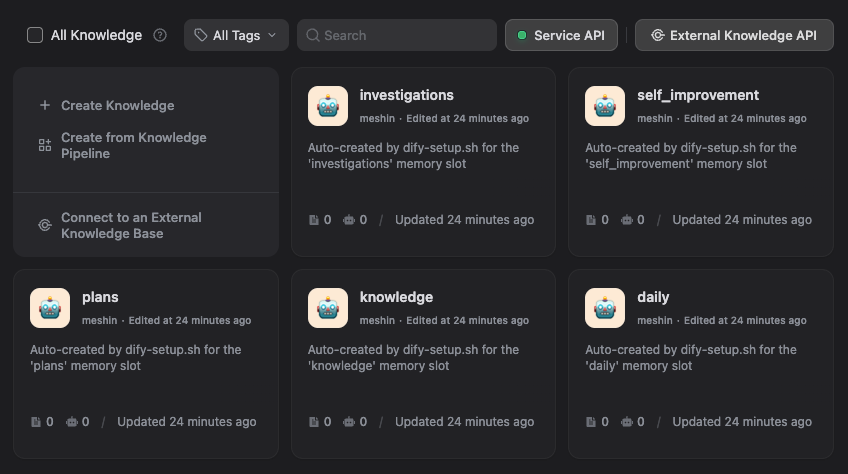
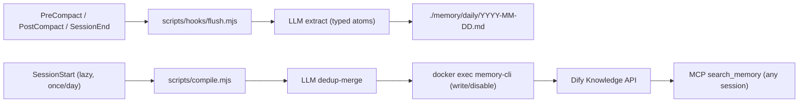

<h1 align="center">Local Dify MCP Memory Boilerplate</h1>

<p align="center">
  <strong>Typed, deduplicated project memory for AI coding agents.</strong>
</p>

<p align="center">
  Local Dify Knowledge for high-precision RAG, a stdio MCP bridge for modern agent clients, and a two-stage <code>flush + compile</code> pipeline that distils sessions into typed atoms instead of dumping transcripts.
</p>

<p align="center">
  <a href="LICENSE"></a>
  
  
  
  
  
  
  
  
</p>

<p align="center">
  <a href="#install">Install</a>
  |
  <a href="#how-memory-is-built">Pipeline</a>
  |
  <a href="#what-gets-saved">Categories</a>
  |
  <a href="#updates">Updates</a>
  |
  <a href="#client-config">Clients</a>
  |
  <a href="STACK.md">Stack docs</a>
</p>

<p align="center">
  
</p>

## Why this exists

Every agent loop produces a few decisions, a few bug root causes, and a lot of noise. Dumping raw transcripts into a vector store turns that signal-to-noise problem into an embedding-space problem: at scale, retrieval surfaces the noise.

This boilerplate replaces the dump with a two-stage pipeline:

1. **Flush.** Lifecycle hooks (`PreCompact`, `PostCompact`, `SessionEnd`) call your local LLM (Claude Code CLI by default, Codex as alternative, or Anthropic/OpenAI APIs) to extract a small set of typed atoms from the recent transcript: decisions, bug root causes, feedback rules, project lore, references, patterns/gotchas. Atoms land in a local daily log (`./memory/daily/YYYY-MM-DD.md`) — Dify is not touched yet.
2. **Compile.** The first `SessionStart` of a new UTC day spawns `compile.mjs` in the background. For each atom in unprocessed daily logs, it queries Dify for near-duplicates and asks the LLM whether to **create**, **update** (supersede an existing doc), or **skip**. Only the survivors land in your knowledge base.

Result: most sessions contribute 0–3 small atoms, dedup-merged across history, with metadata and tags that make retrieval boringly correct.

## Install

The boilerplate is consumed as `./memory/` inside your project, with its own git history retained for `git pull` updates.

```bash
# from inside the project root
git clone https://github.com/ctxr-dev/memory-boilerplate.git ./memory
./memory/bootstrap.sh --slug <project-slug>
./memory/scripts/up.sh
./memory/scripts/ui-url.sh
```

`bootstrap.sh` will:

- Render `.agents/`, `.claude/settings.json`, and append the boilerplate block to your project `.gitignore` (so `/memory` and `/.memory` are ignored).
- Detect available LLM CLIs (`claude` first, then `codex`) and ask which one to use for distillation; falls back to `anthropic` / `openai` when an API key is set.
- Create `memory/.env` from the template, injecting your slug. **Re-runs never touch `memory/.env`.**

After Dify is up:

1. Open the printed UI URL.
2. Create your admin account, configure an embedding model, create a Knowledge base.
3. Open `Service API`, create a Knowledge API key, copy it and the dataset IDs.
4. Edit `memory/.env`:
   ```bash
   DIFY_KNOWLEDGE_API_KEY=...
   DIFY_DATASET_IDS=dataset-uuid-1,dataset-uuid-2
   DIFY_WRITE_DATASET_ID=dataset-uuid-1
   ```
5. Restart only the MCP bridge:
   ```bash
   ./memory/scripts/up.sh <project-slug>-memory
   ./memory/scripts/mcp-smoke.sh
   ```

That is the entire install.

## How memory is built



Two stages, two LLM calls per cycle, one shared knowledge store.

- **Daily logs** are local-only. They never leave your project directory and are rotated after `MEMORY_DAILY_RETENTION_DAYS` (default 30) once compiled.
- **Compile** is the only thing that writes to Dify. It uses the MCP bridge container (`docker exec`) so it shares the bridge's network access to the internal Dify API.
- **Recursion guard**: when the compile run starts a session of its own, the `CLAUDE_INVOKED_BY=memory_compile` env var prevents another compile from kicking off.
- **Failure modes are explicit**: missing LLM provider, missing Dify keys, or a stopped MCP container all cause flush/compile to skip with a stderr message and exit 0. Hooks never block your session.

## What gets saved

Six atom types map to the categories that actually pay off in retrieval:

| Type | Use when |
|---|---|
| `decision` | "We chose X over Y because Z." Architectural or product choice with rationale. |
| `bug-root-cause` | The misleading symptom, the actual cause, and the trap to avoid. (Not the diff — that's in git.) |
| `feedback-rule` | A workflow rule the user gave you. Conventions, exit predicates, do/don't. |
| `project-lore` | Who's doing what, deadlines, integration quirks not in the code. Decays fast — atoms include dates. |
| `reference` | A pointer to a dashboard, runbook, or external project, with the reason to consult it. |
| `pattern-gotcha` | A reusable code-level lesson: API quirk, framework footgun, library behavior. |

Every atom carries `tags` for metadata-filtered search. The compile-stage prompt biases toward **update** over **create** when titles and tags overlap, so the same fact does not get written twice.

## Updates

The cloned `./memory/` keeps its own `.git`, so:

```bash
cd memory && git pull && cd .. && ./memory/bootstrap.sh --slug <project-slug>
```

Re-running bootstrap is idempotent. `memory/.env` is preserved across upgrades — only template-derived files (`.agents/*`, `.claude/settings.json`) are re-rendered.

## Client config

Generated client snippets live under `.agents/clients/` after bootstrap. Print them with:

```bash
./memory/scripts/mcp-config.sh all
./memory/scripts/mcp-config.sh codex
./memory/scripts/mcp-config.sh claude-desktop
./memory/scripts/mcp-config.sh cursor
```

For Codex/OpenAI:

```bash
codex mcp add <project-slug>-memory -- docker exec -i <project-slug>-memory node src/index.js
```

For Claude Desktop, Cursor, or generic MCP clients, merge `.agents/mcp.json` (or the matching snippet under `.agents/clients/`) into your client's MCP config. Do not paste API keys into client configs; they live only in `memory/.env`.

When `--install-hooks` is passed (default on), `.claude/settings.json` is rendered with the four lifecycle events wired to `./memory/scripts/hooks/`. Other clients can adapt `.agents/hooks.json` to their own hook format; see [STACK.md](STACK.md) for the event-to-script table.

## Hook reference

| Event | Script | Effect |
|---|---|---|
| `SessionStart` | `scripts/hooks/session-start.mjs` | Emits an `additionalContext` reminder; lazily spawns compile in the background once per UTC day. |
| `PreCompact` | `scripts/hooks/flush.mjs pre-compact` | Distils the recent transcript into atoms; appends to today's daily log. Skips if fewer than `MEMORY_HOOK_PRECOMPACT_MIN_TURNS` turns. |
| `PostCompact` | `scripts/hooks/flush.mjs post-compact` | Distils Claude Code's `compact_summary` into atoms. |
| `SessionEnd` | `scripts/hooks/flush.mjs session-end` | Same as PreCompact, with `MEMORY_HOOK_SESSION_END_MIN_TURNS` floor. |

The hook timeout is 60s because the LLM call dominates wall-clock time.

## What gets committed

| Path | Tracked | Why |
|---|---|---|
| `/memory` | **No** (gitignored) | The cloned boilerplate has its own `.git`. |
| `/.memory` | **No** (gitignored) | Host-mounted Dify runtime data. |
| `/.agents`, `/.claude/settings.json` | **Yes** (your call) | Per-project agent + hook config. |
| `memory/.env` | **No** (gitignored inside the boilerplate) | Contains your Dify API key. |
| `memory/daily/*.md` | **No** | Scratch; rotated after compile. |

## Repository layout (cloned `./memory/`)

```text
memory/
├── bootstrap.sh                # render project-root files; idempotent
├── compose.mcp.yaml            # Docker Compose override for the MCP bridge
├── .env.example                # template for memory/.env
├── scripts/
│   ├── up.sh, down.sh, ps.sh   # stack lifecycle
│   ├── ui-url.sh               # discover the host UI port
│   ├── dify-bootstrap.sh       # resolve + pin Dify version, clone vendor
│   ├── mcp-config.sh           # print client snippets
│   ├── mcp-smoke.sh            # JSON-RPC smoke against the bridge
│   ├── compile.mjs             # daily logs -> Dify (lazy, dedup-merge)
│   ├── lib/{env,llm,dify-write,redact}.mjs
│   └── hooks/{session-start,pre-compact,post-compact,session-end}.{sh,mjs}
├── prompts/{flush,compile}.md  # LLM extraction + dedup-merge prompts
├── mcp-server/
│   └── src/{index,dify,memory-cli}.js
├── templates/
│   ├── agents/                 # rendered to <project>/.agents/
│   ├── claude/settings.json    # rendered to <project>/.claude/
│   └── gitignore.append        # appended to <project>/.gitignore
├── daily/                      # session atoms (local, rotated)
├── knowledge/                  # optional local cache mirror
└── vendor/dify/                # cloned at first dify-bootstrap
```

For deeper Dify configuration, knowledge-base creation, retrieval tuning, persistence, and troubleshooting, see [STACK.md](STACK.md).
