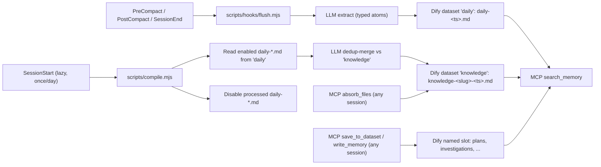

<h1 align="center">🧠 Local Dify MCP Memory — the self-learning RAG that makes your AI stop repeating its mistakes</h1>

<p align="center">
  <strong>Typed, deduplicated, self-improving project memory for AI coding agents.</strong>
</p>

<p align="center">
  A local Dify Knowledge stack for high-precision RAG, a stdio MCP bridge for every modern agent client, a two-stage <code>flush + compile</code> pipeline that distils sessions into typed atoms instead of dumping transcripts, and a dedicated <code>self_improvement</code> dataset where the agent records every correction you give it — and looks up the lesson before related work, so it stops making the same mistake twice.
</p>

<p align="center">
  <a href="LICENSE"></a>
  
  
  
  
  
  
  
  
</p>

<p align="center">
  <a href="#install">Install</a>
  |
  <a href="#how-memory-is-built">Pipeline</a>
  |
  <a href="#what-gets-saved">Categories</a>
  |
  <a href="#updates">Updates</a>
  |
  <a href="#client-config">Clients</a>
  |
  <a href="STACK.md">Stack docs</a>
</p>

<p align="center">
  
</p>

## Why this exists

Every agent loop produces a few decisions, a few bug root causes, and a lot of noise. Dumping raw transcripts into a vector store turns that signal-to-noise problem into an embedding-space problem: at scale, retrieval surfaces the noise.

This boilerplate replaces the dump with a two-stage pipeline:

1. **Flush.** Lifecycle hooks (`PreCompact`, `PostCompact`, `SessionEnd`) call your local LLM (Claude Code CLI by default, Codex as alternative, or Anthropic/OpenAI APIs) to extract a small set of typed atoms from the recent transcript: decisions, bug root causes, feedback rules, project lore, references, patterns/gotchas. The atoms are written to Dify as one document named `daily-<YYYY-MM-DD-HHMMSSmmm>.md` per flush event, easy to scan chronologically in the Dify UI.
2. **Compile.** The first `SessionStart` of a new UTC day spawns `compile.mjs` in the background. It lists enabled `daily-*.md` documents from Dify, parses the atoms, queries Dify for near-duplicate `knowledge-*.md` documents, and asks the LLM whether to **create**, **update** (supersede the existing knowledge doc), or **skip**. Surviving atoms become `knowledge-<slug>-<YYYY-MM-DD-HHMMSSmmm>.md` documents. Source `daily-*.md` documents are then disabled (kept in the UI for audit, hidden from search).

Result: most sessions contribute 0–3 small atoms, dedup-merged across history, with metadata and tags that make retrieval boringly correct.

## Install

The boilerplate is consumed as `./memory/` inside your project, with its own git history retained for `git pull` updates. Two flows: install it yourself, or have an agent drive it.

### Prerequisites

- Docker Desktop 4.x+ with Docker Compose 2.24.4+
- Node 20+ (used at install AND runtime — no `jq` or other extras needed)
- bash 3.2+, plus standard POSIX utilities (`awk`, `sed`, `grep`, `find`, `mktemp`, `tr`, `cut`)
- `git`, `curl`

**Cross-platform:** macOS and Linux are first-class. **Windows works via WSL2 or Git Bash** — bootstrap is bash-only and the install scripts intentionally avoid `jq`, `realpath`, `gsed`, or any other non-portable binary so a Git Bash shell with Docker Desktop is sufficient. Docker bind-mount path translation is handled by Docker Desktop itself.

Windows-specific gotchas:

- **Line endings**: the repo ships `.gitattributes` forcing LF on every shell + Node + config file. If you cloned with `core.autocrlf=true` (Git for Windows default) BEFORE these directives existed locally, run `git add --renormalize . && git checkout .` to fix any CRLF in your working tree, otherwise `bash` will choke on `#!/usr/bin/env bash\r`.
- **Docker Desktop file sharing**: in Docker Desktop → Settings → Resources, ensure the drive (Windows non-WSL) or the WSL2 distro (WSL2 path) that contains your project is enabled for file sharing. Without this, the `${WORKSPACE_DIR}:/workspace:ro` bind in `compose.mcp.yaml` mounts an empty directory and `scan_documents` / `absorb_files` will see no source files.
- **Symlinks**: the repo intentionally ships zero symlinks; do not introduce any locally without enabling Windows Developer Mode (or accept that Git will substitute a 1-line text file for the symlink target).

### Manual install

```bash
# from inside the project root
git clone https://github.com/ctxr-dev/memory-boilerplate.git ./memory
./memory/bootstrap.sh --slug <project-slug>
./memory/scripts/up.sh
./memory/scripts/ui-url.sh
```

`bootstrap.sh` will:

- Render `.agents/` and (when `--install-hooks`, default on) `.claude/settings.json`. **Existing files are structurally merged, never overwritten:** if you already have hooks, MCP servers, or permissions configured, your entries pass through verbatim and only our entries are added or refreshed. The merge is implemented in `scripts/lib/merge-config.mjs` (pure Node, no `jq`); re-runs are byte-stable when nothing changes.
- Append the boilerplate block to your project `.gitignore` (so `/memory` and `/.memory` are ignored). Idempotent: a marker line guards re-runs.
- Detect available LLM CLIs (`claude` first, then `codex`) and ask which one to use for distillation; falls back to `anthropic` / `openai` when an API key is set.
- Create `memory/.env` from the template, injecting your slug. **Re-runs never touch `memory/.env`.**

After Dify is up, finish wiring with the **onboarding wizard** (manual or AI-driven, see [Onboarding](#onboarding)):

```bash
./memory/scripts/dify-setup.sh
./memory/scripts/mcp-smoke.sh
```

That is the entire install. The wizard handles the API key, the five default dataset slots (`daily`, `knowledge`, `plans`, `investigations`, `self_improvement`), the per-document metadata schema on each slot, and an optional first-pass absorb of your existing project documentation.

### 🤖 AI-driven install

Paste this prompt into your agent (Claude Code, Cursor, Codex) running inside the target project root:

```text
Install the local Dify MCP memory boilerplate into this project. Target the current working directory unless I explicitly give you another path.

Steps:

1. Confirm the boilerplate Git URL with me first if you cannot infer it. Default: https://github.com/ctxr-dev/memory-boilerplate.git

2. Ask me for the project slug. Lowercase ASCII a-z, 0-9, hyphen (e.g. billing-api, docs-site). If I give you a name, propose a sanitised slug derived from the project folder name and confirm. The slug becomes the per-project Docker container, image, and Compose project name, so multiple projects can run their own memory stacks without collisions.

3. Ask me which LLM provider to use for the flush + compile pipeline:
   - claude (recommended; spawns `claude -p`, no API key needed)
   - codex (spawns `codex exec --json`, no API key needed)
   - anthropic (REST with ANTHROPIC_API_KEY in memory/.env)
   - openai (REST with OPENAI_API_KEY in memory/.env)
   Detect which CLIs are on PATH before asking. If only one is available, default to it and ask me to confirm.

4. Ask whether to install Claude Code hooks (default: yes). Hooks live in .claude/settings.json and wire SessionStart, PreCompact, PostCompact, SessionEnd to ./memory/scripts/hooks/. Other clients can adapt .agents/hooks.json manually.

5. Ask which MCP clients to register: Claude Desktop, Cursor, Codex/OpenAI, generic. Print the matching snippet from .agents/clients/ for each I confirm. For Codex/OpenAI, run: codex mcp add <slug>-memory -- docker exec -i <slug>-memory node src/index.js

6. Verify host prerequisites or tell me exactly what is missing: docker compose 2.24.4+, node 20+, git, curl, bash, openssl/shasum.

7. Run the install:
   git clone <boilerplate-git-url> ./memory
   ./memory/bootstrap.sh --slug <slug> --llm-provider <provider> [--no-hooks if I declined]

8. Run the verification commands from the README's "Verification" section after install.

9. Start the stack:
   ./memory/scripts/up.sh
   ./memory/scripts/ui-url.sh

10. Tell me the exact next steps after install:
    a) Open the printed Dify UI URL.
    b) Create the admin account, configure an embedding model.
    c) Open Knowledge -> Service API, create a Knowledge API key.
    d) Run `./memory/scripts/dify-setup.sh` to wire datasets and (optionally) absorb my existing docs.

Stop and ask me whenever you would otherwise guess. Do not proceed past any step on assumption. Do not edit memory/.env directly, even after install: the wizard handles that.
```

The agent runs the install host-side; the onboarding wizard ([Onboarding](#onboarding)) finishes the Dify-side wiring after the stack is up.

## Onboarding

`dify-setup.sh` is a re-runnable wizard. Once Dify is up and you have admin/embedding configured in the UI, it asks at most four kinds of questions:

1. **`DIFY_KNOWLEDGE_API_KEY`** — paste it now (or skip if you already added it to `memory/.env`).
2. **For each dataset slot** declared in `memory/.env` (every `DIFY_DATASET_<NAME>_ID=` line is one slot; defaults are `daily, knowledge, plans, investigations, self_improvement`):
   - Auto-create a Dify dataset with that exact name (high_quality + hybrid_search by default — full-text + vector indexes both populated) and bind its id to `DIFY_DATASET_<NAME>_ID`.
   - Or paste an existing dataset id you want to re-use.
   - Or skip the slot.
3. **Metadata schema** — for every bound slot, the wizard installs the six per-document metadata fields (`atom_type`, `tags`, `project_module`, `language`, `task_type`, `error_pattern`) and offers to enable Dify's built-in fields (`document_name`, `upload_date`, `last_update_date`).
4. **Bridge restart** — the wizard restarts the MCP bridge so the new env propagates.
5. **Absorb existing docs?** — optional. Scans the workspace for matching files, lets you pick which ones go into which slot (defaults to `knowledge`), then upserts each as a Dify document with name = relative path with `/` replaced by `_` (e.g. `docs/auth/jwt.md` becomes `docs_auth_jwt.md`). Re-running the absorb later overwrites the same doc instead of duplicating.

### Manual flow

```bash
./memory/scripts/up.sh           # start Dify + MCP bridge
./memory/scripts/ui-url.sh       # open the printed Dify UI URL
                                 # In Dify: admin -> embedding model -> Service API -> create Knowledge API key
./memory/scripts/dify-setup.sh   # paste key, bind/create slots, optional absorb
./memory/scripts/mcp-smoke.sh    # validate
```

Want to add another slot later? Add a new `DIFY_DATASET_<NAME>_ID=` line to `memory/.env` (e.g. `DIFY_DATASET_RUNBOOKS_ID=`), then re-run `./memory/scripts/dify-setup.sh` — it will only ask about the new slot. After upgrading the boilerplate via `git pull`, recreate the bridge so it picks up new env lines: `./memory/scripts/up.sh` (rebuilds + recreates) or `docker compose -p $COMPOSE_PROJECT_NAME up -d --no-build memory_mcp` for env-only refresh.

### 🤖 AI-driven flow

Paste the prompt below to your agent (Claude Code, Cursor, Codex with the MCP server registered):

```text
Set up the Dify memory boilerplate for this project. The MCP server is `<project-slug>-memory`. Do this:

1. Verify DIFY_KNOWLEDGE_API_KEY is set in memory/.env. If not, STOP. Tell me to:
   (a) Open the Dify UI URL printed by ./memory/scripts/ui-url.sh
   (b) Sign in, configure an embedding model under Settings → Model Provider (REQUIRED before any high_quality dataset can be created)
   (c) Knowledge → Service API → create a Knowledge API key
   (d) Paste the key into memory/.env as DIFY_KNOWLEDGE_API_KEY=<key>
   (e) Restart the bridge: ./memory/scripts/up.sh
   THEN re-run me. Do not attempt to proceed without the key — `dify-setup.sh --non-interactive` will exit FATAL.

2. Call `list_datasets` to see what already exists in Dify.
3. For each of these slots (daily, knowledge, plans, investigations, self_improvement), check whether a dataset with that name already exists.
   - If it exists, tell me the id and ask whether to bind it.
   - If it does not, ask whether to call `create_dataset` to create it (high_quality + hybrid_search; requires the embedding model from step 1).
4. Tell me which DIFY_DATASET_<NAME>_ID values to put in memory/.env, then I will run `./memory/scripts/dify-setup.sh --non-interactive --auto-create` to commit them, OR you tell me the exact lines to paste. The wizard also installs the per-document metadata schema (atom_type, tags, project_module, language, task_type, error_pattern) on every bound slot.
5. Then call `scan_documents` (default globs cover .md/.mdx/.markdown/.txt/.rst/.adoc) and show me the file list with proposed doc names.
6. Ask which subset I want absorbed and into which slot (default: knowledge). Use `absorb_files` with `dryRun=true` first, show me the result, and only do the real call after I confirm.

Stop and ask me whenever you would otherwise guess. This is configuration, not refactoring.
```

The agent uses the MCP tools `list_datasets`, `create_dataset`, `scan_documents`, `absorb_files`, and `save_to_dataset` to drive the conversation. None of those mutate anything outside Dify; the wizard is what writes memory/.env.

### Saving plans, investigations, or other artefacts manually

The MCP tool `save_to_dataset(dataset, name, text, metadata?)` does upsert-by-exact-name. That means if you save `plan-auth-rewrite.md` once and then again later (after polishing), the second call replaces the first document — no duplicates accumulate even when you iterate. Same applies to absorbed files. The optional `metadata` map applies the per-document Dify metadata fields so the doc is filterable in future `search_memory` and `recall_lessons` calls.

For Claude Code / Codex hooks that should auto-dump plan/investigation artefacts to RAG when finalised: see [STACK.md](STACK.md) — the integration points are `PostToolUse` matchers that observe `ExitPlanMode` and similar lifecycle events. Wiring those is outside this commit's scope; the MCP tools are ready, the hook recipes are not yet shipped.

## Self-improvement loop

A dedicated dataset slot, `self_improvement`, captures lessons learned **only** when the user gives negative or corrective feedback. These are higher-priority than ordinary atoms: agents are expected to check them before related work.

### Two MCP entry points

- **`recall_lessons(query, project_module?, language?, task_type?, error_pattern?, tags?, includeKnowledge?, scoreThreshold?, maxResults?)`** — call BEFORE non-trivial work. Searches the `self_improvement` dataset filtered to `atom_type=self-improvement-lesson` plus the supplied context. Broadens via a fall-back ladder (drop `error_pattern` → `language` → `task_type`) and accumulates UNIQUE hits across rungs until at least `min(3, maxResults)` distinct hits or the ladder is exhausted. `project_module` and `tags` are scoping signals the caller chose deliberately and are NEVER dropped. Defaults: `scoreThreshold=0.55`, `maxResults=5`. When `project_module` is provided AND `includeKnowledge !== false` (default true), also pulls top `bug-root-cause` and `feedback-rule` atoms from `knowledge` matching the same `project_module` (max 2 supplementary records, appended after lessons, never displacing them).
- **`save_lesson(title, body, metadata, tags?, evidence?)`** — call IMMEDIATELY when the user corrects you (before replying). Required `metadata.error_pattern` is the dedup key — different lessons with the same `error_pattern` will MERGE in compile rather than multiply. The doc name `lesson-<slug>-<ts>.md` matches the format compile recognises, so inline-saved lessons participate in the same dedup-merge pipeline. Available on the next turn.

### Two capture paths feed `self_improvement`

1. **Inline (`save_lesson`)** — agent observes correction mid-session and persists immediately. Queryable on the very next turn.
2. **Flush extraction** — `prompts/flush.md` recognises a `self-improvement-lesson` atom type with explicit triggers (direct correction, repeat correction, wrong-tool/wrong-step). Lessons missed mid-session are captured at PreCompact / PostCompact / SessionEnd boundaries. Compile then routes them to `self_improvement` and dedup-merges by `error_pattern`.

### Lesson extraction criteria (what counts)

Trigger conditions for the LLM extractor and the inline path:

- Direct correction: "no", "stop doing X", "you should have done Y", reverting your work, "wrong".
- Repeat correction: "I told you before", "again", "same mistake", "we've covered this".
- Wrong-tool / wrong-step: the user pointed out you used the wrong file, command, format, or skipped a step.

Explicit non-triggers (do NOT save):

- Routine clarification or neutral redirection ("let's switch to X").
- The user changing their mind about scope.
- User self-blame ("oh wait, I gave you the wrong file").
- Exploration or thinking out loud.

### Metadata schema

Six per-document fields are installed on every bound dataset slot by `dify-setup.sh` (Dify only supports string/number/time, so tags is a comma-separated string queried with `contains`):

| Field | Used by `recall_lessons` for | Notes |
|---|---|---|
| `atom_type` | filter by atom type | one of the seven types; `self-improvement-lesson` is the lesson key |
| `project_module` | filter by part-of-codebase | lowercase, hyphenated; `unknown` when unsure |
| `language` | filter by programming language | empty for language-agnostic lessons |
| `task_type` | filter by task category | enum: planning, implementation, debugging, refactor, review, deploy, docs, unknown |
| `error_pattern` | filter and DEDUP by failure mode | required for `save_lesson`; short kebab-case slug like `missing-await`, `bsd-sed-no-arg` |
| `tags` | fulltext-style fallback | comma-separated list, queried with `contains` |

Built-in Dify fields (`document_name`, `upload_date`, `last_update_date`) can be enabled by the wizard for recency-based filtering.

### Retrieval contract (applies to all datasets, not just self-improvement)

`search_memory` accepts:

```
search_memory({
  query,
  datasets?: ["self_improvement", "knowledge"],
  filters?: { atom_type, project_module, language, task_type, error_pattern, tags },
  scoreThreshold?: 0..1,
  maxResults?: number
})
```

Filters become a Dify `metadata_condition` (AND-combined; `tags` uses `contains`, everything else uses `is`) applied **before** the embedding rank. `scoreThreshold` becomes `retrieval_model.score_threshold` so low-similarity hits never reach the agent. **Do not load the whole store**: filtered + thresholded retrieval is the contract.

## How memory is built



Two stages of automatic capture (flush + compile), plus on-demand `absorb_files`, `save_to_dataset`, and `save_lesson`. **Everything is stored in Dify**, organised by named dataset slots, retrieved via metadata-filtered queries.

- **Named slots** declared by env lines: every `DIFY_DATASET_<NAME>_ID=` in `memory/.env` declares one slot. Defaults are `daily`, `knowledge`, `plans`, `investigations`, `self_improvement`. Add more by adding lines (`DIFY_DATASET_RUNBOOKS_ID=`, `DIFY_DATASET_DECISIONS_ID=`, ...). No second list to maintain.
- **Per-atom-type routing**: compile sends `self-improvement-lesson` atoms to `self_improvement` and everything else to `knowledge`. Inline `save_lesson` hits `self_improvement` directly.
- **No local memory files.** The only on-disk state is a tiny ops file `./memory/.compile-state.json` that records the last compile attempt date. Memory content lives only in Dify.
- **Naming conventions inside Dify**:
  - `daily-<YYYY-MM-DD-HHMMSSmmm>.md` — one per flush event, accumulates per session, dedup-merged out by compile.
  - `knowledge-<slug>-<YYYY-MM-DD-HHMMSSmmm>.md` — one per deduped fact; compile may write a new version with the same `<slug>` and a new `<ts>`, then disable the prior one.
  - `lesson-<slug>-<YYYY-MM-DD-HHMMSSmmm>.md` — self-improvement lessons in the `self_improvement` slot.
  - `<relative_path_with_underscores>.md` — absorbed user docs (`docs/auth/jwt.md` becomes `docs_auth_jwt.md`).
  - `<your-name>.md` — anything you upsert via `save_to_dataset` (plans, investigations, decisions). The same name overwrites; iterate freely.
- **Per-document metadata** (`atom_type`, `tags`, `project_module`, `language`, `task_type`, `error_pattern`) is set on every promoted/upserted doc so retrieval can filter Dify-side instead of dragging the whole store back. Schema is auto-installed by `dify-setup.sh`.
- **Daily docs are kept after promotion** but disabled (hidden from `search_memory`, visible in the Dify UI for audit).
- **Recursion guard**: when the compile run starts a session of its own, the `CLAUDE_INVOKED_BY=memory_compile` env var prevents another compile from kicking off.
- **Failure modes are explicit**: missing LLM provider, missing Dify keys, or a stopped MCP container all cause flush/compile/absorb to skip with a stderr message and exit 0. Hooks never block your session and never write fallback files.

## What gets saved

Two routes: **automatic distillation** (flush + compile) and **on-demand upserts** (absorb + save_to_dataset).

### Automatic atoms (extracted from session transcripts)

Seven atom types map to the categories that actually pay off in retrieval. Each atom carries the metadata block (`project_module`, `language`, `task_type`, optional `error_pattern`) plus `tags`.

| Type | Use when | Routes to |
|---|---|---|
| `decision` | "We chose X over Y because Z." Architectural or product choice with rationale. | `knowledge` |
| `bug-root-cause` | The misleading symptom, the actual cause, and the trap to avoid. (Not the diff — that's in git.) | `knowledge` |
| `feedback-rule` | A workflow rule the user gave you. Conventions, exit predicates, do/don't. | `knowledge` |
| `project-lore` | Who's doing what, deadlines, integration quirks not in the code. Decays fast — atoms include dates. | `knowledge` |
| `reference` | A pointer to a dashboard, runbook, or external project, with the reason to consult it. | `knowledge` |
| `pattern-gotcha` | A reusable code-level lesson: API quirk, framework footgun, library behavior. | `knowledge` |
| `self-improvement-lesson` | The user gave NEGATIVE OR CORRECTIVE feedback that reveals a behaviour the AI should change next time. | `self_improvement` |

The compile-stage prompt biases toward **update** over **create** when atom_type, project_module, and (for lessons) error_pattern match. Same fact does not get written twice; same lesson converges into one canonical document.

### On-demand uploads (any artefact you want indexed)

| MCP tool | When | Naming + identity |
|---|---|---|
| `absorb_files(files[], dataset?, dryRun?)` | Index existing project docs (`docs/**/*.md`, `ARCHITECTURE.md`, RFCs). | `relative/path/with/slashes.md` becomes `relative_path_with_slashes.md`. Re-running overwrites the same Dify document. |
| `save_to_dataset(dataset, name, text)` | Save a plan, investigation, decision record, runbook. | The `name` IS the identity. Polishing the same `plan-auth-rewrite.md` later replaces the prior version, no duplicates. |

Both use upsert-by-exact-name (delete-then-create), so the contract is: **same name → updated content; different name → new document**. This is the property the user asked for: "if the plan md filename is the same it should always be updated in RAG".

### MCP tools

| Tool | Purpose |
|---|---|
| `search_memory` | Retrieve scored chunks across configured datasets. Accepts `filters` (metadata) and `scoreThreshold` for precise, context-efficient recall. |
| `recall_lessons` | "Look before you leap" entry point. Filters `self_improvement` by inferred task context with broadening fall-back; optionally pulls `bug-root-cause` + `feedback-rule` from `knowledge`. |
| `get_memory_config` | Inspect bridge configuration without exposing secrets. |
| `write_memory` | Create-or-supersede a single document (low-level). |
| `update_memory` | Required-supersedes variant; used by compile. |
| `save_to_dataset` | Upsert by exact name with optional `metadata` (the durable-artefact path). |
| `save_lesson` | Sugar over `save_to_dataset` for the `self_improvement` slot; required metadata.error_pattern is the dedup key. |
| `list_datasets` | Show Dify datasets + local slot bindings. |
| `create_dataset` | Create a new Dify dataset; bind it via `dify-setup.sh`. |
| `scan_documents` | Walk the workspace mount; return matches + suggested doc names. The default ignore list (multi-stack vendor/build/cache/IDE protection: `.git`, `node_modules`, `.venv`, `__pycache__`, `target`, `vendor`, `dist`, `build`, `.next`, `Pods`, `DerivedData`, `_build`, `.terraform`, `.idea`, etc., at any nesting depth) is ALWAYS applied; any `ignore` patterns you pass are added on top, never used as a replacement. `include` defaults to markdown/text; pass `include` to override. |
| `absorb_files` | Read selected files; upsert each into the chosen dataset. |

## Updates

The cloned `./memory/` keeps its own `.git`, so:

```bash
cd memory && git pull && cd .. && ./memory/bootstrap.sh --slug <project-slug>
./memory/scripts/up.sh    # recreate the bridge so it picks up env changes
```

Re-running bootstrap is idempotent. `memory/.env` is preserved across upgrades — only template-derived files (`.agents/*`, `.claude/settings.json`, `.agents/rules/*`, `.claude/skills/*`) are re-rendered. The bridge container reads `memory/.env` via Compose's `env_file:` directive, so any new `DIFY_DATASET_<NAME>_ID=` line you add only takes effect after a recreate; `up.sh` handles that. Existing `memory/.env` slots survive the upgrade.

> **Note on locally edited config files:**
>
> - **Mixed-content files (`.claude/settings.json`, `.agents/hooks.json`, `.agents/mcp.json`):** bootstrap performs a deterministic structural merge via `scripts/merge-config.mjs` (pure Node, no `jq`). Your existing entries — your own MCP servers, your own hook commands, your `permissions`, your `model`, anything else at the top level — pass through verbatim. Only entries whose `command` carries the boilerplate's signature (`"$CLAUDE_PROJECT_DIR"/memory/scripts/hooks/...`) are stripped and re-installed on each re-run, so your customisations are safe across `git pull` upgrades. Re-runs are byte-stable when the rendered template hasn't changed.
> - **Owned-only files (snippets under `.agents/clients/`, `.agents/mcp/<server>.mcp.json`, `.agents/README.md`):** these are 100% generated by the boilerplate and have no user content. Bootstrap REFUSES to overwrite if you have edited them — it prints a conflict list and exits non-zero. Either accept the boilerplate's version (delete the file then re-run bootstrap) or move your edits elsewhere.
> - **Skill files (`.claude/skills/*.md`, `.agents/rules/*.md`):** always overwritten on re-run; treat them as canonical from the boilerplate.

## Client config

Generated client snippets live under `.agents/clients/` after bootstrap. Print them with:

```bash
./memory/scripts/mcp-config.sh all
./memory/scripts/mcp-config.sh codex
./memory/scripts/mcp-config.sh claude-desktop
./memory/scripts/mcp-config.sh cursor
```

For Codex/OpenAI:

```bash
codex mcp add <project-slug>-memory -- docker exec -i <project-slug>-memory node src/index.js
```

For Claude Desktop, Cursor, or generic MCP clients, merge `.agents/mcp.json` (or the matching snippet under `.agents/clients/`) into your client's MCP config. Do not paste API keys into client configs; they live only in `memory/.env`.

When `--install-hooks` is passed (default on), `.claude/settings.json` is rendered with the four lifecycle events wired to `./memory/scripts/hooks/`. Other clients can adapt `.agents/hooks.json` to their own hook format; see [STACK.md](STACK.md) for the event-to-script table.

### Skills + rules

`bootstrap.sh` renders every file under `templates/skills/*.md` into BOTH:

- `.claude/skills/<name>.md` (only when `--install-hooks`) — Claude Code's project skills directory; auto-loaded.
- `.agents/rules/<name>.md` (always) — vendor-neutral. Cursor / Codex / generic clients can import from here.

Today the boilerplate ships one skill: `self-improvement.md` (the `recall_lessons` + `save_lesson` contract).

## Hook reference

| Event | Script | Effect |
|---|---|---|
| `SessionStart` | `scripts/hooks/session-start.mjs` | Emits an `additionalContext` reminder; lazily spawns compile in the background once per UTC day. |
| `PreCompact` | `scripts/hooks/flush.mjs pre-compact` | Distils the recent transcript into typed atoms and writes ONE new `daily-<ts>.md` document to the Dify daily dataset. Skips if fewer than `MEMORY_HOOK_PRECOMPACT_MIN_TURNS` turns. |
| `PostCompact` | `scripts/hooks/flush.mjs post-compact` | Distils Claude Code's `compact_summary` into atoms and writes one `daily-<ts>.md` document. Min-turns check is bypassed for compact_summary input. |
| `SessionEnd` | `scripts/hooks/flush.mjs session-end` | Same as PreCompact, with `MEMORY_HOOK_SESSION_END_MIN_TURNS` floor. |

The hook timeout is 130s for the flush hooks (PreCompact/PostCompact/SessionEnd) and 15s for SessionStart. Flush calls an LLM that defaults to a 120s per-call timeout, so the hook needs at least that plus headroom; SessionStart only emits a reminder and spawns compile detached, so it returns quickly.

## What gets committed

| Path | Tracked | Why |
|---|---|---|
| `/memory` | **No** (gitignored) | The cloned boilerplate has its own `.git`. |
| `/.memory` | **No** (gitignored) | Host-mounted Dify runtime data. |
| `/.agents`, `/.claude/settings.json` | **Yes** (your call) | Per-project agent + hook config. |
| `memory/.env` | **No** (gitignored inside the boilerplate) | Contains your Dify API key. |
| `memory/.compile-state.json` | **No** | One-line ops state (last compile date). Not memory. |
| `memory/.compile.lock` | **No** | Transient lockfile preventing concurrent compile runs. |

## Verification

Run after `bootstrap.sh` and again after `dify-setup.sh`:

```bash
# Static checks (no Docker required)
bash -n ./memory/bootstrap.sh ./memory/scripts/*.sh ./memory/scripts/hooks/*.sh
node --check ./memory/scripts/compile.mjs ./memory/scripts/hooks/flush.mjs ./memory/scripts/hooks/session-start.mjs
node --check ./memory/scripts/lib/*.mjs ./memory/mcp-server/src/*.js

# Unit tests (no npm deps; uses node's built-in test runner)
( cd ./memory && node --test test/*.test.mjs )   # or: ( cd ./memory && npm test )

# Stack health (Docker required)
./memory/scripts/ps.sh
./memory/scripts/ui-url.sh

# End-to-end MCP smoke (after dify-setup.sh has bound at least one dataset)
./memory/scripts/mcp-smoke.sh

# Optional: dry-run a flush + compile pass without writing to Dify
echo '{"session_id":"smoke","hook_event_name":"PostCompact","compact_summary":"Decision: Dify is the canonical store for project memory."}' \
  | ./memory/scripts/hooks/post-compact.sh
node ./memory/scripts/compile.mjs --dry-run

# Verify metadata schema is installed on the self_improvement slot
docker exec -i "$(grep '^MCP_CONTAINER_NAME=' ./memory/.env | cut -d= -f2 | tr -d '\r')" \
  node src/memory-cli.js list-metadata-fields --datasetId self_improvement
# expect doc_metadata to include atom_type, tags, project_module,
# language, task_type, error_pattern.

# Filtered search smoke against the self_improvement slot
# (this only RETRIEVES; pair it with a save_lesson MCP call from your
# agent if you want a true save -> recall round-trip)
docker exec -i "$(grep '^MCP_CONTAINER_NAME=' ./memory/.env | cut -d= -f2 | tr -d '\r')" \
  node src/memory-cli.js search --datasetId self_improvement \
  --query "smoke" --filters '{"atom_type":"self-improvement-lesson"}'

# Run the unit-test suite (no Dify, no Docker, hermetic; node 20+)
node --test test/*.test.mjs   # or: npm test
```

If `mcp-smoke.sh` fails with "No datasets configured" or "Flush slot 'daily' has no configured id", run `./memory/scripts/dify-setup.sh` to bind the slots.

## Repository layout (cloned `./memory/`)

```text
memory/
├── bootstrap.sh                # render project-root files; idempotent
├── compose.mcp.yaml            # Docker Compose override for the MCP bridge
├── .env.example                # template for memory/.env
├── scripts/
│   ├── up.sh, down.sh, ps.sh   # stack lifecycle
│   ├── ui-url.sh               # discover the host UI port
│   ├── dify-bootstrap.sh       # resolve + pin Dify version, clone vendor
│   ├── dify-setup.sh           # interactive dataset binding + metadata
│   │                           # schema installer + absorb wizard
│   ├── mcp-config.sh           # print client snippets
│   ├── mcp-smoke.sh            # JSON-RPC smoke against the bridge
│   ├── compile.mjs             # daily -> knowledge / self_improvement
│   │                           # promotion (per-atom-type routing,
│   │                           # metadata-filtered dedup-merge)
│   ├── merge-config.mjs        # CLI used by bootstrap.sh to structurally
│   │                           # merge our hooks/MCP entries into the
│   │                           # user's existing .claude/settings.json
│   │                           # and .agents/{hooks,mcp}.json without
│   │                           # losing user content
│   ├── lib/{env,llm,dify-write,redact,slug,datasets,lock,merge-config}.mjs
│   └── hooks/
│       ├── session-start.{sh,mjs}    # lazy compile trigger + reminder
│       ├── pre-compact.sh            # -> flush.mjs pre-compact
│       ├── post-compact.sh           # -> flush.mjs post-compact
│       ├── session-end.sh            # -> flush.mjs session-end
│       └── flush.mjs                 # shared extractor (incl. self-
│                                     # improvement-lesson type + metadata)
├── prompts/{flush,compile}.md  # LLM extraction + dedup-merge prompts
├── mcp-server/
│   └── src/{index,dify,memory-cli,glob,slug}.js
├── templates/
│   ├── agents/                 # rendered to <project>/.agents/
│   ├── claude/settings.json    # rendered to <project>/.claude/
│   ├── skills/self-improvement.md  # rendered to .claude/skills/ AND .agents/rules/
│   └── gitignore.append        # appended to <project>/.gitignore
└── vendor/dify/                # cloned at first dify-bootstrap

# Memory is stored entirely in Dify, organised by named slot, named:
#   daily-<YYYY-MM-DD-HHMMSSmmm>.md             (one per flush event, daily slot)
#   knowledge-<slug>-<YYYY-MM-DD-HHMMSSmmm>.md  (one per deduped fact, knowledge slot)
#   lesson-<slug>-<YYYY-MM-DD-HHMMSSmmm>.md     (one per deduped lesson, self_improvement slot)
```

For deeper Dify configuration, knowledge-base creation, retrieval tuning, persistence, and troubleshooting, see [STACK.md](STACK.md).
