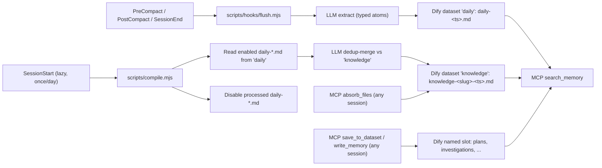

<h1 align="center">Local Dify MCP Memory Boilerplate</h1>

<p align="center">
  <strong>Typed, deduplicated project memory for AI coding agents.</strong>
</p>

<p align="center">
  Local Dify Knowledge for high-precision RAG, a stdio MCP bridge for modern agent clients, and a two-stage <code>flush + compile</code> pipeline that distils sessions into typed atoms instead of dumping transcripts.
</p>

<p align="center">
  <a href="LICENSE"></a>
  
  
  
  
  
  
  
  
</p>

<p align="center">
  <a href="#install">Install</a>
  |
  <a href="#how-memory-is-built">Pipeline</a>
  |
  <a href="#what-gets-saved">Categories</a>
  |
  <a href="#updates">Updates</a>
  |
  <a href="#client-config">Clients</a>
  |
  <a href="STACK.md">Stack docs</a>
</p>

<p align="center">
  
</p>

## Why this exists

Every agent loop produces a few decisions, a few bug root causes, and a lot of noise. Dumping raw transcripts into a vector store turns that signal-to-noise problem into an embedding-space problem: at scale, retrieval surfaces the noise.

This boilerplate replaces the dump with a two-stage pipeline:

1. **Flush.** Lifecycle hooks (`PreCompact`, `PostCompact`, `SessionEnd`) call your local LLM (Claude Code CLI by default, Codex as alternative, or Anthropic/OpenAI APIs) to extract a small set of typed atoms from the recent transcript: decisions, bug root causes, feedback rules, project lore, references, patterns/gotchas. The atoms are written to Dify as one document named `daily-<YYYY-MM-DD-HHMMSSmmm>.md` per flush event, easy to scan chronologically in the Dify UI.
2. **Compile.** The first `SessionStart` of a new UTC day spawns `compile.mjs` in the background. It lists enabled `daily-*.md` documents from Dify, parses the atoms, queries Dify for near-duplicate `knowledge-*.md` documents, and asks the LLM whether to **create**, **update** (supersede the existing knowledge doc), or **skip**. Surviving atoms become `knowledge-<slug>-<YYYY-MM-DD-HHMMSSmmm>.md` documents. Source `daily-*.md` documents are then disabled (kept in the UI for audit, hidden from search).

Result: most sessions contribute 0–3 small atoms, dedup-merged across history, with metadata and tags that make retrieval boringly correct.

## Install

The boilerplate is consumed as `./memory/` inside your project, with its own git history retained for `git pull` updates. Two flows: install it yourself, or have an agent drive it.

### Manual install

```bash
# from inside the project root
git clone https://github.com/ctxr-dev/memory-boilerplate.git ./memory
./memory/bootstrap.sh --slug <project-slug>
./memory/scripts/up.sh
./memory/scripts/ui-url.sh
```

`bootstrap.sh` will:

- Render `.agents/`, `.claude/settings.json`, and append the boilerplate block to your project `.gitignore` (so `/memory` and `/.memory` are ignored).
- Detect available LLM CLIs (`claude` first, then `codex`) and ask which one to use for distillation; falls back to `anthropic` / `openai` when an API key is set.
- Create `memory/.env` from the template, injecting your slug. **Re-runs never touch `memory/.env`.**

After Dify is up, finish wiring with the **onboarding wizard** (manual or AI-driven, see [Onboarding](#onboarding)):

```bash
./memory/scripts/dify-setup.sh
./memory/scripts/mcp-smoke.sh
```

That is the entire install. The wizard handles the API key, the four default dataset slots (`daily`, `knowledge`, `plans`, `investigations`), and an optional first-pass absorb of your existing project documentation.

### AI-driven install

Paste this prompt into your agent (Claude Code, Cursor, Codex) running inside the target project root:

```text
Install the local Dify MCP memory boilerplate into this project. Target the current working directory unless I explicitly give you another path.

Steps:

1. Confirm the boilerplate Git URL with me first if you cannot infer it. Default: https://github.com/ctxr-dev/memory-boilerplate.git

2. Ask me for the project slug. Lowercase ASCII a-z, 0-9, hyphen (e.g. billing-api, docs-site). If I give you a name, propose a sanitised slug derived from the project folder name and confirm. The slug becomes the per-project Docker container, image, and Compose project name, so multiple projects can run their own memory stacks without collisions.

3. Ask me which LLM provider to use for the flush + compile pipeline:
   - claude (recommended; spawns `claude -p`, no API key needed)
   - codex (spawns `codex exec --json`, no API key needed)
   - anthropic (REST with ANTHROPIC_API_KEY in memory/.env)
   - openai (REST with OPENAI_API_KEY in memory/.env)
   Detect which CLIs are on PATH before asking. If only one is available, default to it and ask me to confirm.

4. Ask whether to install Claude Code hooks (default: yes). Hooks live in .claude/settings.json and wire SessionStart, PreCompact, PostCompact, SessionEnd to ./memory/scripts/hooks/. Other clients can adapt .agents/hooks.json manually.

5. Ask which MCP clients to register: Claude Desktop, Cursor, Codex/OpenAI, generic. Print the matching snippet from .agents/clients/ for each I confirm. For Codex/OpenAI, run: codex mcp add <slug>-memory -- docker exec -i <slug>-memory node src/index.js

6. Verify host prerequisites or tell me exactly what is missing: docker compose 2.24.4+, node 20+, git, curl, bash, openssl/shasum.

7. Run the install:
   git clone <boilerplate-git-url> ./memory
   ./memory/bootstrap.sh --slug <slug> --llm-provider <provider> [--no-hooks if I declined]

8. Run the syntax/config validation listed in the boilerplate README's "Verification" section after install.

9. Start the stack:
   ./memory/scripts/up.sh
   ./memory/scripts/ui-url.sh

10. Tell me the exact next steps after install:
    a) Open the printed Dify UI URL.
    b) Create the admin account, configure an embedding model.
    c) Open Knowledge -> Service API, create a Knowledge API key.
    d) Run `./memory/scripts/dify-setup.sh` to wire datasets and (optionally) absorb my existing docs.

Stop and ask me whenever you would otherwise guess. Do not proceed past any step on assumption. Do not edit memory/.env directly, even after install: the wizard handles that.
```

The agent runs the install host-side; the onboarding wizard ([Onboarding](#onboarding)) finishes the Dify-side wiring after the stack is up.

## Onboarding

`dify-setup.sh` is a re-runnable wizard. Once Dify is up and you have admin/embedding configured in the UI, it asks at most four kinds of questions:

1. **`DIFY_KNOWLEDGE_API_KEY`** — paste it now (or skip if you already added it to `memory/.env`).
2. **For each dataset slot** in `DIFY_DATASETS` (defaults: `daily, knowledge, plans, investigations`):
   - Auto-create a Dify dataset with that exact name and bind its id to `DIFY_DATASET_<NAME>_ID`.
   - Or paste an existing dataset id you want to re-use.
   - Or skip the slot.
3. **Bridge restart** — the wizard restarts the MCP bridge so the new env propagates.
4. **Absorb existing docs?** — optional. Scans the workspace for matching files, lets you pick which ones go into which slot (defaults to `knowledge`), then upserts each as a Dify document with name = relative path with `/` replaced by `_` (e.g. `docs/auth/jwt.md` becomes `docs_auth_jwt.md`). Re-running the absorb later overwrites the same doc instead of duplicating.

### Manual flow

```bash
./memory/scripts/up.sh           # start Dify + MCP bridge
./memory/scripts/ui-url.sh       # open the printed Dify UI URL
                                 # In Dify: admin -> embedding model -> Service API -> create Knowledge API key
./memory/scripts/dify-setup.sh   # paste key, bind/create slots, optional absorb
./memory/scripts/mcp-smoke.sh    # validate
```

Want to add another slot later? Edit `DIFY_DATASETS` in `memory/.env` (e.g. add `runbooks`), then re-run `./memory/scripts/dify-setup.sh` — it will only ask about the new slot.

### AI-driven flow

Paste the prompt below to your agent (Claude Code, Cursor, Codex with the MCP server registered):

```text
Set up the Dify memory boilerplate for this project. The MCP server is `<project-slug>-memory`. Do this:

1. Call `list_datasets` to see what already exists in Dify.
2. For each of these slots (daily, knowledge, plans, investigations), check whether a dataset with that name already exists.
   - If it exists, tell me the id and ask whether to bind it.
   - If it does not, ask whether to call `create_dataset` to create it.
3. Tell me which DIFY_DATASET_<NAME>_ID values to put in memory/.env, then I will run `./memory/scripts/dify-setup.sh --non-interactive --auto-create` to commit them, OR you tell me the exact lines to paste.
4. Then call `scan_documents` (default globs cover .md/.mdx/.markdown/.txt/.rst/.adoc) and show me the file list with proposed doc names.
5. Ask which subset I want absorbed and into which slot (default: knowledge). Use `absorb_files` with `dryRun=true` first, show me the result, and only do the real call after I confirm.

Stop and ask me whenever you would otherwise guess. This is configuration, not refactoring.
```

The agent uses the MCP tools `list_datasets`, `create_dataset`, `scan_documents`, `absorb_files`, and `save_to_dataset` to drive the conversation. None of those mutate anything outside Dify; the wizard is what writes memory/.env.

### Saving plans, investigations, or other artefacts manually

The MCP tool `save_to_dataset(dataset, name, text)` does upsert-by-exact-name. That means if you save `plan-auth-rewrite.md` once and then again later (after polishing), the second call replaces the first document — no duplicates accumulate even when you iterate. Same applies to absorbed files.

For Claude Code / Codex hooks that should auto-dump plan/investigation artefacts to RAG when finalised: see [STACK.md](STACK.md) — the integration points are `PostToolUse` matchers that observe `ExitPlanMode` and similar lifecycle events. Wiring those is outside this commit's scope; the MCP tools are ready, the hook recipes are not yet shipped.

## How memory is built



Two stages of automatic capture (flush + compile), plus on-demand `absorb_files` and `save_to_dataset` for documentation and artefact upserts. **Everything is stored in Dify**, organised by named dataset slots.

- **Named slots** (default: `daily`, `knowledge`, `plans`, `investigations`) declared in `DIFY_DATASETS`. Each slot has its own `DIFY_DATASET_<NAME>_ID`. Add as many as you want (e.g. `runbooks`, `decisions`, `incidents`) and re-run `dify-setup.sh`.
- **No local memory files.** The only on-disk state is a tiny ops file `./memory/.compile-state.json` that records the last compile attempt date. Memory content lives only in Dify.
- **Naming conventions inside Dify**:
  - `daily-<YYYY-MM-DD-HHMMSSmmm>.md` — one per flush event, accumulates per session, dedup-merged out by compile.
  - `knowledge-<slug>-<YYYY-MM-DD-HHMMSSmmm>.md` — one per deduped fact; compile may write a new version with the same `<slug>` and a new `<ts>`, then disable the prior one.
  - `<relative_path_with_underscores>.md` — absorbed user docs (`docs/auth/jwt.md` becomes `docs_auth_jwt.md`).
  - `<your-name>.md` — anything you upsert via `save_to_dataset` (plans, investigations, decisions). The same name overwrites; iterate freely.
- **Daily docs are kept after promotion** but disabled (hidden from `search_memory`, visible in the Dify UI for audit).
- **Recursion guard**: when the compile run starts a session of its own, the `CLAUDE_INVOKED_BY=memory_compile` env var prevents another compile from kicking off.
- **Failure modes are explicit**: missing LLM provider, missing Dify keys, or a stopped MCP container all cause flush/compile/absorb to skip with a stderr message and exit 0. Hooks never block your session and never write fallback files.

## What gets saved

Two routes: **automatic distillation** (flush + compile) and **on-demand upserts** (absorb + save_to_dataset).

### Automatic atoms (extracted from session transcripts)

Six atom types map to the categories that actually pay off in retrieval:

| Type | Use when |
|---|---|
| `decision` | "We chose X over Y because Z." Architectural or product choice with rationale. |
| `bug-root-cause` | The misleading symptom, the actual cause, and the trap to avoid. (Not the diff — that's in git.) |
| `feedback-rule` | A workflow rule the user gave you. Conventions, exit predicates, do/don't. |
| `project-lore` | Who's doing what, deadlines, integration quirks not in the code. Decays fast — atoms include dates. |
| `reference` | A pointer to a dashboard, runbook, or external project, with the reason to consult it. |
| `pattern-gotcha` | A reusable code-level lesson: API quirk, framework footgun, library behavior. |

Every atom carries `tags` for metadata-filtered search. The compile-stage prompt biases toward **update** over **create** when titles and tags overlap, so the same fact does not get written twice.

### On-demand uploads (any artefact you want indexed)

| MCP tool | When | Naming + identity |
|---|---|---|
| `absorb_files(files[], dataset?, dryRun?)` | Index existing project docs (`docs/**/*.md`, `ARCHITECTURE.md`, RFCs). | `relative/path/with/slashes.md` becomes `relative_path_with_slashes.md`. Re-running overwrites the same Dify document. |
| `save_to_dataset(dataset, name, text)` | Save a plan, investigation, decision record, runbook. | The `name` IS the identity. Polishing the same `plan-auth-rewrite.md` later replaces the prior version, no duplicates. |

Both use upsert-by-exact-name (delete-then-create), so the contract is: **same name → updated content; different name → new document**. This is the property the user asked for: "if the plan md filename is the same it should always be updated in RAG".

### MCP tools

| Tool | Purpose |
|---|---|
| `search_memory` | Retrieve scored chunks across configured datasets. |
| `get_memory_config` | Inspect bridge configuration without exposing secrets. |
| `write_memory` | Create-or-supersede a single document (low-level). |
| `update_memory` | Required-supersedes variant; used by compile. |
| `save_to_dataset` | Upsert by exact name (the durable-artefact path). |
| `list_datasets` | Show Dify datasets + local slot bindings. |
| `create_dataset` | Create a new Dify dataset; bind it via `dify-setup.sh`. |
| `scan_documents` | Walk the workspace mount; return matches + suggested doc names. |
| `absorb_files` | Read selected files; upsert each into the chosen dataset. |

## Updates

The cloned `./memory/` keeps its own `.git`, so:

```bash
cd memory && git pull && cd .. && ./memory/bootstrap.sh --slug <project-slug>
```

Re-running bootstrap is idempotent. `memory/.env` is preserved across upgrades — only template-derived files (`.agents/*`, `.claude/settings.json`) are re-rendered.

## Client config

Generated client snippets live under `.agents/clients/` after bootstrap. Print them with:

```bash
./memory/scripts/mcp-config.sh all
./memory/scripts/mcp-config.sh codex
./memory/scripts/mcp-config.sh claude-desktop
./memory/scripts/mcp-config.sh cursor
```

For Codex/OpenAI:

```bash
codex mcp add <project-slug>-memory -- docker exec -i <project-slug>-memory node src/index.js
```

For Claude Desktop, Cursor, or generic MCP clients, merge `.agents/mcp.json` (or the matching snippet under `.agents/clients/`) into your client's MCP config. Do not paste API keys into client configs; they live only in `memory/.env`.

When `--install-hooks` is passed (default on), `.claude/settings.json` is rendered with the four lifecycle events wired to `./memory/scripts/hooks/`. Other clients can adapt `.agents/hooks.json` to their own hook format; see [STACK.md](STACK.md) for the event-to-script table.

## Hook reference

| Event | Script | Effect |
|---|---|---|
| `SessionStart` | `scripts/hooks/session-start.mjs` | Emits an `additionalContext` reminder; lazily spawns compile in the background once per UTC day. |
| `PreCompact` | `scripts/hooks/flush.mjs pre-compact` | Distils the recent transcript into atoms; appends to today's daily log. Skips if fewer than `MEMORY_HOOK_PRECOMPACT_MIN_TURNS` turns. |
| `PostCompact` | `scripts/hooks/flush.mjs post-compact` | Distils Claude Code's `compact_summary` into atoms. |
| `SessionEnd` | `scripts/hooks/flush.mjs session-end` | Same as PreCompact, with `MEMORY_HOOK_SESSION_END_MIN_TURNS` floor. |

The hook timeout is 60s because the LLM call dominates wall-clock time.

## What gets committed

| Path | Tracked | Why |
|---|---|---|
| `/memory` | **No** (gitignored) | The cloned boilerplate has its own `.git`. |
| `/.memory` | **No** (gitignored) | Host-mounted Dify runtime data. |
| `/.agents`, `/.claude/settings.json` | **Yes** (your call) | Per-project agent + hook config. |
| `memory/.env` | **No** (gitignored inside the boilerplate) | Contains your Dify API key. |
| `memory/.compile-state.json` | **No** | One-line ops state (last compile date). Not memory. |

## Repository layout (cloned `./memory/`)

```text
memory/
├── bootstrap.sh                # render project-root files; idempotent
├── compose.mcp.yaml            # Docker Compose override for the MCP bridge
├── .env.example                # template for memory/.env
├── scripts/
│   ├── up.sh, down.sh, ps.sh   # stack lifecycle
│   ├── ui-url.sh               # discover the host UI port
│   ├── dify-bootstrap.sh       # resolve + pin Dify version, clone vendor
│   ├── mcp-config.sh           # print client snippets
│   ├── mcp-smoke.sh            # JSON-RPC smoke against the bridge
│   ├── compile.mjs             # daily -> knowledge promotion (lazy, dedup-merge)
│   ├── dify-setup.sh           # interactive dataset binding + absorb wizard
│   ├── lib/{env,llm,dify-write,redact,slug}.mjs
│   └── hooks/{session-start,pre-compact,post-compact,session-end}.{sh,mjs}
├── prompts/{flush,compile}.md  # LLM extraction + dedup-merge prompts
├── mcp-server/
│   └── src/{index,dify,memory-cli,glob}.js
├── templates/
│   ├── agents/                 # rendered to <project>/.agents/
│   ├── claude/settings.json    # rendered to <project>/.claude/
│   └── gitignore.append        # appended to <project>/.gitignore
└── vendor/dify/                # cloned at first dify-bootstrap

# Memory is stored entirely in Dify, named:
#   daily-<YYYY-MM-DD-HHMMSSmmm>.md          (one per flush event)
#   knowledge-<slug>-<YYYY-MM-DD-HHMMSSmmm>.md  (one per deduped fact)
```

For deeper Dify configuration, knowledge-base creation, retrieval tuning, persistence, and troubleshooting, see [STACK.md](STACK.md).
