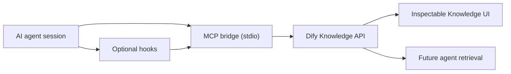

<h1 align="center">Local Dify MCP Memory Boilerplate</h1>

<p align="center">
  <strong>Inspectable local project memory for AI coding agents.</strong>
</p>

<p align="center">
  Dify Knowledge for high-precision RAG, a stdio MCP bridge for modern agent clients, and optional hooks that preserve fresh session context before it disappears.
</p>

<p align="center">
  <a href="LICENSE"></a>
  
  
  
  
  
  
  
  
  
  
  
  
  
  
  
  
  
</p>

<p align="center">
  <a href="#copyable-ai-install-prompt">Install with AI</a>
  |
  <a href="#install-into-a-project">Manual install</a>
  |
  <a href="#client-support">Clients</a>
  |
  <a href="#continuous-memory-hooks">Hooks</a>
</p>

<p align="center">
  
</p>

> Give every project its own local memory system: Dify for inspectable high-precision RAG, a stdio MCP bridge for Codex/OpenAI, Claude Desktop, Cursor, and other MCP clients, and optional hooks for continuous session capture.

The goal is intentionally practical: an AI agent should be able to install this into a fresh repo, ask only the necessary questions, start the local stack, wire the MCP client where possible, and leave you with one human task: open Dify, create the knowledge bases, and paste the generated API values into `memory/.env`.

## At A Glance

| Need | What this gives you |
| --- | --- |
| Inspect memory instead of trusting magic | Dify Knowledge UI with datasets, chunks, indexing state, and retrieval tests |
| Keep projects isolated | Per-project container names, Compose project names, images, and `.memory/dify/` data |
| Use modern AI clients | MCP snippets for Codex/OpenAI, Claude Desktop, Cursor, and generic MCP JSON |
| Preserve session knowledge | Optional hooks for `SessionStart`, `PreCompact`, `PostCompact`, and `SessionEnd` |
| Avoid hidden state | No hardcoded host paths, no copied secrets, no vendored Dify runtime data |



## Why This Exists

A Karpathy-style `LLM Wiki`, or an `llms.txt`-style folder of LLM-friendly project notes, is a great starting point. For tiny projects, a few Markdown files are fast, transparent, and easy for agents to read.

But once the project grows, the wiki starts fighting you:

- every file becomes another thing the model must remember to open
- old decisions mix with new decisions
- duplicate notes drift out of sync
- exact symbols, file names, incidents, and architectural decisions become hard to retrieve
- long-running agent sessions need a place to persist what happened before compaction or shutdown

At that point, you usually do not need more Markdown. You need a real local RAG system with chunk inspection, retrieval testing, hybrid search, reranking, durable storage, and MCP access. This boilerplate is the migration path from "small LLM wiki" to "project memory that can keep up."

## What You Get

- A local Dify stack per project, isolated by Docker Compose project/container names.
- Dify Knowledge UI for inspecting documents, chunks, embeddings, retrieval tests, and API keys.
- Host-mounted persistence under `.memory/dify/`.
- A deterministic MCP bridge that uses stdio, not another exposed host port.
- Client snippets for Codex/OpenAI, Claude Desktop, Cursor, and generic MCP JSON.
- Optional Claude Code hooks for `SessionStart`, `PreCompact`, `PostCompact`, and `SessionEnd`.
- No copied runtime data, no copied secrets, and no hardcoded host paths.
- A single copyable AI prompt designed for repeatable installs into future projects.

## What It Looks Like

The screenshot above is the Dify Knowledge UI that backs the project memory: visible datasets, document counts, indexing settings, retrieval testing, and a Service API key that the MCP bridge uses.

Thanks to the Dify team and community for building the local-first RAG platform that makes this kind of inspectable project memory practical. This repo is only a thin project template and MCP bridge around that excellent foundation.

## Copyable AI Install Prompt

Copy this prompt into an AI agent when you want to install this boilerplate into a new project:

```text
Install the local Dify MCP memory boilerplate into this project.

Target the current project directory unless I explicitly give you another target.

First, determine the boilerplate Git URL. Use the URL of this GitHub repository if available. If you cannot see the repository URL, ask me for it before doing anything else.

Then clone the boilerplate repository into a tracked temporary location:
memory_boilerplate_repo_url="<confirmed-boilerplate-git-url>"
tmp_dir="$(mktemp -d)"
git clone "$memory_boilerplate_repo_url" "$tmp_dir/memory-boilerplate"

Before installing, ask me for the project slug to use. Explain that this slug is needed to generate isolated Docker Compose, container, image, and MCP server names so multiple projects can run their own memory stacks without conflicts. The slug should be lowercase ASCII using only `a-z`, `0-9`, and `-`, for example `billing-api` or `docs-site`. If I provide a human project name instead of a slug, suggest a sanitized slug derived from the target project folder name or project name and ask for confirmation before installing. After install, read the exact `Memory MCP server` value printed by the installer and use that exact value in all later commands.

Also ask whether I want to install active continuous memory hooks now. Explain that hooks can automatically capture SessionEnd, PreCompact, and PostCompact context into Dify once memory/.env is configured; before Dify is configured they skip cleanly. Claude Code hooks are supported directly, while other clients need hook support or can use MCP manually. Do not install active hook config unless I explicitly confirm. If I decline hooks, install the MCP memory stack only.

Requirements:
- Before installing, verify host prerequisites or tell me exactly what is missing: Docker with Docker Compose 2.24.4+ using `docker compose version`, git, curl, bash, standard Unix tools, `openssl` or `shasum`/`sha256sum`, Node.js 20+ for hooks/validation/smoke tests, Python 3.11+ for validation snippets, and network access to GitHub plus Docker/npm registries.
- Do not copy real .memory data from any other project.
- Do not copy memory/.env secrets from any other project.
- Keep memory/vendor empty in the template; let memory/scripts/bootstrap.sh clone Dify at setup time.
- Let the first bootstrap resolve the current Dify release and pin it in memory/.dify-version.
- Preserve stdio MCP transport: docker exec -i <slug>-memory node src/index.js.
- Do not introduce hardcoded host paths.
- Install the template with project-specific names generated from the slug.
- Ensure the project .gitignore ignores generated memory/.env, memory/vendor contents, and .memory/dify runtime data while keeping .keep placeholders.
- Ask which MCP client(s) I want configured now: Codex/OpenAI, Claude Desktop, Cursor, or generic MCP JSON. Configure every confirmed client automatically when possible by merging the generated server entry from `.agents/mcp.json` or `.agents/clients/` into that client's existing config, preserving unrelated settings and never writing secrets into client config.
- Install active hook config only if I confirmed hooks. If confirmed, pass `--install-hooks` and validate `.agents/hooks.json` plus `.claude/settings.json`; otherwise do not create those active hook files.
- If Codex/OpenAI was selected and the `codex` CLI is available, register MCP with: codex mcp add <actual-memory-server-name> -- docker exec -i <actual-memory-server-name> node src/index.js.
- For Claude Desktop, Cursor, or another MCP client, ask for the config file path if it is not discoverable from the current environment. If no writable config path is available or I decline config edits, print the matching generated snippet from `.agents/clients/` or `./memory/scripts/mcp-config.sh` as the explicit fallback.
- If hooks were confirmed, tell me exactly which hook files were installed and that no extra manual hook setup is needed for Claude Code. For non-Claude hook-capable clients, print the event-to-script mapping from `memory/README.md`.
- Run the exact syntax/config validation checks listed below after install.
- Start the stack with ./memory/scripts/up.sh.
- Print the Dify UI URL from ./memory/scripts/ui-url.sh.
- Tell me exactly which values I need to add to memory/.env after creating the Dify Knowledge API key and dataset IDs in the UI.

Installation command shape:
"$tmp_dir/memory-boilerplate/install.sh" <target-project-dir> --slug <confirmed-slug>

If I confirmed hooks, use this command shape instead:
"$tmp_dir/memory-boilerplate/install.sh" <target-project-dir> --slug <confirmed-slug> --install-hooks

Validation commands to run from the target project after install:
python3 -m json.tool .agents/mcp.json >/dev/null
python3 -m json.tool .agents/clients/generic-mcp.json >/dev/null
python3 -m json.tool .agents/clients/claude-desktop.json >/dev/null
python3 -m json.tool .agents/clients/cursor.json >/dev/null
python3 - <<'PY'
import tomllib
with open('.agents/clients/openai-codex.toml', 'rb') as f:
    tomllib.load(f)
PY
bash -n memory/scripts/*.sh memory/scripts/hooks/*.sh
node --check memory/mcp-server/src/dify.js
node --check memory/mcp-server/src/index.js
node --check memory/mcp-server/src/ingest-session.js
node --check memory/scripts/hooks/session-memory-hook.mjs
node --check memory/scripts/hooks/session-start.mjs
./memory/scripts/mcp-config.sh all

If hooks were confirmed and installed, also run:
python3 -m json.tool .agents/hooks.json >/dev/null
python3 -m json.tool .claude/settings.json >/dev/null

After I configure memory/.env, restart the MCP bridge with the exact memory server name printed by the installer, then validate with:
./memory/scripts/up.sh <actual-memory-server-name>
./memory/scripts/mcp-smoke.sh
```

The installed project layout is:

```text
memory/              stack scripts, MCP bridge, Dify compose override
.memory/             host-mounted Dify runtime data, created per project
.agents/             universal MCP config and client adapter snippets
.agents/hooks.json   optional hook manifest, only installed with --install-hooks
.claude/settings.json optional Claude Code hook adapter, only installed with --install-hooks
```

No real Dify data is included in this boilerplate. The template contains only `.memory/dify/.keep`. The installed `memory/vendor/` directory is also empty except for `.keep`; `./memory/scripts/bootstrap.sh` resolves the current Dify release on first bootstrap, writes the chosen tag to `memory/.dify-version`, and clones that pinned release into `memory/vendor/dify`.

## Prerequisites

The runtime stack is Dockerized, but the installer, validation scripts, and optional hooks still need a few host tools:

- Docker with Docker Compose 2.24.4 or newer. The compose override uses `!override` and `!reset`, so validate with `docker compose version`.
- `git` and `curl` so bootstrap can resolve and clone Dify.
- `bash` for the installer and helper scripts.
- Standard Unix tools: `sed`, `awk`, `grep`, `find`, `mktemp`, `cmp`, `tail`, `chmod`, and `cp`.
- `openssl`, `shasum`, or `sha256sum` for local secret generation during bootstrap.
- Node.js 20+ for hook entrypoints, MCP source validation, and `mcp-smoke.sh`.
- Python 3.11+ for the README validation snippets.
- Network access to GitHub, Docker registries, and the npm registry during first bootstrap/build.

If hooks are not installed, Node is still useful for validation and smoke checks, while the MCP bridge itself runs inside Docker.

## Install Into A Project

From this boilerplate repo:

```bash
./install.sh /path/to/project --slug project-slug
```

To install active continuous-memory hooks at the same time:

```bash
./install.sh /path/to/project --slug project-slug --install-hooks
```

If you omit `--slug`, the installer derives it from the target directory name. The slug is used to generate isolated names:

```text
project-slug-memory
project-slug-memory-stack
project-slug-memory-mcp:local
```

This prevents container and Docker Compose conflicts across projects.

The installer refuses to overwrite existing different files. Hook config is opt-in: `.agents/hooks.json` and `.claude/settings.json` are only installed when `--install-hooks` is passed. For projects that already have `.agents/` or `.claude/settings.json`, merge manually or move conflicting files first.

The installer also appends idempotent entries to the target project's root `.gitignore` so generated secrets, cloned Dify vendor files, and `.memory/dify` runtime data are not accidentally committed. `memory/.dify-version` is intentionally not ignored; commit it when you want every machine to use the same Dify release.

## Client Support

The template is not Claude-only. The installed `.agents/` folder is the canonical source for agent/client configuration:

```text
.agents/mcp.json                         canonical MCP server JSON
.agents/mcp/<slug>-memory.mcp.json       per-server snippet
.agents/clients/generic-mcp.json         generic MCP JSON
.agents/clients/claude-desktop.json      Claude Desktop snippet
.agents/clients/cursor.json              Cursor snippet
.agents/clients/openai-codex.toml        Codex/OpenAI TOML snippet
.agents/hooks.json                       optional hook manifest, only with --install-hooks
```

Use the helper to print client-specific config from the installed project:

```bash
./memory/scripts/mcp-config.sh all
./memory/scripts/mcp-config.sh codex
./memory/scripts/mcp-config.sh claude-desktop
./memory/scripts/mcp-config.sh cursor
```

Codex/OpenAI can be registered directly:

```bash
codex mcp add project-slug-memory -- docker exec -i project-slug-memory node src/index.js
```

When `--install-hooks` is used, Claude Code hooks are mirrored into `.claude/settings.json` because Claude Code expects that project settings file. Other clients can still use the MCP tools even if they do not support hook events.

## Start The Stack

In the target project:

```bash
./memory/scripts/up.sh
./memory/scripts/ui-url.sh
```

On first run, `up.sh` resolves the current Dify release and pins it in `memory/.dify-version`. Later restarts reuse that version instead of silently upgrading against existing `.memory/dify` database/vector data. Open the printed Dify UI URL, create the admin account/workspace, configure embedding/reranker providers, and create one or more Knowledge bases.

## Configure Dify API Access

In Dify:

1. Open `Knowledge`.
2. Create the Knowledge base that should receive session memory.
3. Open `Service API`.
4. Create/copy the Knowledge API key.
5. Copy dataset IDs for the Knowledge bases you want available through MCP.

Then edit `memory/.env` in the target project:

```bash
DIFY_KNOWLEDGE_API_KEY=...
DIFY_DATASET_IDS=dataset-uuid-1,dataset-uuid-2
DIFY_WRITE_DATASET_ID=session-memory-dataset-uuid
```

Restart only the MCP bridge:

```bash
./memory/scripts/up.sh project-slug-memory
```

Validate:

```bash
./memory/scripts/mcp-smoke.sh
```

## MCP Transport

The MCP bridge uses stdio. It does not open a host port.

MCP clients launch:

```bash
docker exec -i project-slug-memory node src/index.js
```

Then they exchange JSON-RPC over stdin/stdout. Dify itself is reached from inside Docker at `http://api:5001/v1`.

For Claude Desktop, Cursor, or a generic MCP client, merge the generated `.agents/mcp.json` server or the matching `.agents/clients/` snippet into that client's MCP config.

For Codex/OpenAI:

```bash
codex mcp add project-slug-memory -- docker exec -i project-slug-memory node src/index.js
```

Or install and register in one step:

```bash
./install.sh /path/to/project --slug project-slug --register-codex
```

## Continuous Memory Hooks

Hooks are opt-in. Install them during setup with:

```bash
./install.sh /path/to/project --slug project-slug --install-hooks
```

The hook-enabled install creates:

```text
.agents/hooks.json
.claude/settings.json
```

Those files configure Claude Code hooks:

```text
SessionStart
PreCompact
PostCompact
SessionEnd
```

`PreCompact`, `PostCompact`, and `SessionEnd` write directly into Dify through the MCP bridge container. They do not create session-note sidecar files. `SessionStart` injects a short reminder that project memory is available through MCP.

Until `memory/.env` contains a Knowledge API key and write dataset ID, write hooks skip cleanly and print the missing configuration. After Dify is configured, upload/API failures are surfaced as real hook errors.

Hook-created Dify documents use the `conversation` process-rule preset by default:

```text
separator: "\n\n### "
max_tokens: 700
chunk_overlap: 120
remove_extra_spaces: true
remove_urls_emails: false
```

Tune these in target `memory/.env`:

```bash
DIFY_SESSION_PROCESS_RULE_PRESET=conversation
DIFY_SESSION_PROCESS_RULE_JSON=
MEMORY_HOOK_MAX_TURNS=30
MEMORY_HOOK_MAX_CHARS=80000
MEMORY_HOOK_SESSION_END_MIN_TURNS=1
MEMORY_HOOK_PRECOMPACT_MIN_TURNS=5
```

## What Not To Commit

Do not commit generated secrets unless you intentionally want them in the project repository:

```text
memory/.env
memory/vendor/dify/
```

`.memory/dify/` contains real Dify runtime data: Postgres, vector index, uploaded files, plugin state, and Redis data. Commit or back it up only if you intentionally want to preserve that local memory state in the repository.

The generated stack pins the default local Dify profile to Postgres plus Weaviate and bind-mounts that runtime state under `.memory/dify/`. If you intentionally change Dify to another vector store or external database, add matching bind mounts or external backups before relying on the same persistence guarantee.
